# Freelancer Gewerbe Guide

## Contents

- [Предисловие](#предисловие)
- [Об Авторе](#об-авторе)
- [Список изменений](#список-изменений)
- [Глава 1. Введение](#глава-1-введение)
  - [Кто такие фрилансеры и владельцы Gewerbe в Германии?](#кто-такие-фрилансеры-и-владельцы-gewerbe-в-германии)
  - [Фрилансер (Freiberufler)](#фрилансер-freiberufler)
  - [Gewerbe (владельцы собственного бизнеса)](#gewerbe-владельцы-собственного-бизнеса)
  - [Основные различия между фрилансером и владельцем Gewerbe](#основные-различия-между-фрилансером-и-владельцем-gewerbe)
  - [Регистрация в Elster](#регистрация-в-elster)
  - [Быстрая Регистрация Freiberufler](#быстрая-регистрация-freiberufler)
  - [Подробная регистрация](#подробная-регистрация)
  - [Чек-лист первых 90 дней фриланса](#чек-лист-первых-90-дней-фриланса)
- [2. Про налоги](#2-про-налоги)
  - [Виды налогов для фрилансеров/гевербе](#виды-налогов-для-фрилансеровгевербе)
  - [НДС (Umsatzsteuer) и особенности его уплаты](#ндс-umsatzsteuer-и-особенности-его-уплаты)
  - [Оптимизация налогов и ограничения для фрилансеров](#оптимизация-налогов-и-ограничения-для-фрилансеров)
  - [Автомобиль для работы](#автомобиль-для-работы)
  - [Личный автомобиль для работы](#личный-автомобиль-для-работы)
  - [Kinderfreibetrag: налоговое облегчение для родителей](#kinderfreibetrag-налоговое-облегчение-для-родителей)
  - [Как учитывать расходы и сохранять чеки?](#как-учитывать-расходы-и-сохранять-чеки)
  - [Упрощённые вычеты (Постоянные паушальные суммы)](#упрощённые-вычеты-постоянные-паушальные-суммы)
  - [Применение системы Kleinunternehmerregelung](#применение-системы-kleinunternehmerregelung)
  - [Применение Europäische Kleinunternehmerregelung с 2025 года](#применение-europäische-kleinunternehmerregelung-с-2025-года)
  - [Калькулятор налогов](#калькулятор-налогов)
  - [Налоговый консультант](#налоговый-консультант)
  - [Когда можно обойтись без налогового консультанта?](#когда-можно-обойтись-без-налогового-консультанта)
  - [Когда стоит задуматься о налоговом консультанте в зависимости от дохода?](#когда-стоит-задуматься-о-налоговом-консультанте-в-зависимости-от-дохода)
  - [Где искать налогового консультанта?](#где-искать-налогового-консультанта)
  - [FAQ по налогам/учёту](#faq-коротко)
- [3. Бухгалтерия и счета](#3-бухгалтерия-и-счета)
  - [Основные моменты EÜR](#основные-моменты-eür)
  - [Как устроена EÜR?](#как-устроена-eür)
  - [Кто обязан подавать EÜR?](#кто-обязан-подавать-eür)
  - [Как создать и подать EÜR?](#как-создать-и-подать-eür)
  - [Какие расходы можно учесть в EÜR?](#какие-расходы-можно-учесть-в-eür)
  - [Программное обеспечение для учета](#программное-обеспечение-для-учета)
  - [Выставление счетов](#выставление-счетов)
  - [Кейсы для международных клиентов и платформ](#кейсы-выставления-счетов-для-международных-клиентов-и-платформ)
  - [Выставление счет (за пределами ЕС)](#выставление-счет-за-пределами-ес)
  - [Шаблон для выставления счета](#шаблон-для-выставления-счета)
  - [Выставление счетов через сайт и онлайн платформы](#выставление-счетов-через-сайт-и-онлайн-платформы)
  - [Годовая отчетность](#годовая-отчетность)
- [4. ПО для Бухгалтерии](#4-по-для-бухгалтерии)
- [5. Банки](#5-банки)
  - [Обзор популярных онлайн банков для фрилансеров в Германии](#обзор-популярных-онлайн-банков-для-фрилансеров-в-германии)
- [6. Страховки](#6-страховки)
- [7. Работа](#7-работа)
  - [Расчет своей стоимости на рынке труда](#расчет-своей-стоимости-на-рынке-труда)
  - [Где и как искать работу ( Kundenakquise für Freelancer)?](#где-и-как-искать-работу-kundenakquise-für-freelancer)
  - [Потеря работы и государственная поддержка](#потеря-работы-и-государственная-поддержка)
  - [Виды контрактов для фрилансера](#виды-контрактов-для-фрилансера)
  - [Расторжение договора и пример письма](#расторжение-договора-и-пример-письма)
  - [Фиктивная занятость (scheinselbständigkeit)](#фиктивная-занятость-scheinselbständigkeit)
- [8. Подработка как самозанятый](#8-подработка-как-самозанятый)
  - [Шаблон письма работодателю о Nebentätigkeit](#шаблон-письма-работодателю-о-nebentätigkeit-de)
- [Краткий глоссарий](#краткий-глоссарий)
- [FAQ](#faq-коротко)
- [10 типичных ошибок новичка](#10-типичных-ошибок-новичка)
- [9. Заключение](#9-заключение)

**Важно (B2B e-Rechnung с 01.01.2025):** Все компании, включая Kleinunternehmer, обязаны уметь принимать и хранить структурированные e-Rechnung (XML/XRechnung); PDF сам по себе — не e-Rechnung. Быстрый чек-лист — в TL;DR блока раздела про счета.

## Предисловие

Фриланс в Германии — это разнообразный и гибкий путь, который может быть идеальным решением для тех, кто ценит свободу выбора, самостоятельность и контроль над своим рабочим графиком. Однако каждый шаг в сторону фриланса — это личный выбор, зависящий от множества факторов: вашего характера, профессиональных навыков и текущей ситуации на рынке труда.

Некоторым нравится работать в одиночку, брать ответственность за проекты и самостоятельно управлять временем. Другим важен более стабильный график и гарантированный поток задач от постоянных клиентов. Важно понимать, что фриланс — это не просто свобода от офисных рутин, но и ответственность за все аспекты ведения собственного бизнеса: от поиска клиентов и заключения договоров до соблюдения налоговых и юридических норм.

Фриланс в Германии подчиняется определённым правилам, будь то регистрация в качестве представителя свободной профессии (Freie Berufe) или как предприниматель (Gewerbetreibende). Каждый из этих путей имеет свои особенности и бюрократические нюансы, требующие внимания. Этот переход может быть как вдохновляющим, так и полным вызовов, особенно если вы не готовы к сложности административных процессов, налоговых обязательств и постоянного самоменеджмента.

Однако, при грамотном подходе и правильной подготовке, фриланс в Германии может стать ключом к профессиональной свободе и развитию. Это путь, который открывает новые возможности для роста, но требует чёткого понимания всех его аспектов и готовности к постоянному самосовершенствованию.

"А мне оно вообще надо?" – думаете вы в паузах между заказами. Ведь каждый немецкий бухгалтер так рад помочь вам заполнить декларацию за скромные 200 евро в час (ага, как будто у вас их нет!). А когда клиент говорит, что хотел бы "сделать паузу на месяц с оплатой", вы вдруг осознаёте: все эти риски теперь лежат на вас. Никаких больничных, отпусков или 13-й зарплаты. Только вы, ваш компьютер и... ваши налоги.

Итак, оно вам надо? Если вы любите приключения, немецкий язык и бюрократию — да, конечно! А если нет, то, может, стоит пересмотреть мечты о свободе и остаться в комфортной роли штатного сотрудника.

## Об Авторе

Привет! Меня зовут Илья Федотов, и я уже более шести лет живу в Германии, где последние два года работаю full-time фрилансером в сфере IT. С более чем 20-летним опытом в качестве Microsoft Solution Architect, я участвовал в крупных проектах по миграции и внедрению IT-инфраструктуры для международных компаний, таких как Deutsche Bank, Fujitsu Services и Infosys. В этом руководстве я расскажу о своём опыте перехода на фриланс, начиная с регистрации и заканчивая годовым отчетом и поиском клиентов. Моя информация основана на моем опыте фрилансера в Германии и поможет вам избежать распространенных ошибок на пути к независимости. Но сразу предупреждаю: я не финансовый гуру и не бухгалтер, так что все, что вы сделаете на основе этого текста — на ваш страх и риск. Ну, знаете, стандартное "я вас предупредил" 😊.

Сразу оговорюсь: в этом тексте не будет долгих объяснений про получение визы фрилансера. Этот шаг вам нужно пройти самостоятельно, прежде чем вы сможете зарегистрироваться в качестве фрилансера в Германии. И да, это только начало веселья!

Буду рад услышать ваши замечания и пожелания по поводу этого руководства. Вы всегда можете связаться со мной по email fedotov.ilya (at) gmail.com или через LinkedIn [<u>https://www.linkedin.com/in/fedotovi/</u>](https://www.linkedin.com/in/fedotovi/).

## Список изменений

| **Название изменения** | **Страница** | **Дата** | **Комментарии** | **Автор** |
|----|:--:|:--:|:--:|:--:|
| Обязательный приём e-Rechnung (TL;DR в оглавлении + блок в подработке) | Весь документ | 22.11.2025 | B2B приём обязателен с 2025, PDF ≠ e-Rechnung | Илья |
| Europäische Kleinunternehmerregelung с 2025 | 32 | 08.01.2025 | Нововведения 2025 год | Илья |
| E-Rechnungspflicht | 42 | 08.01.2025 | Нововведения 2025 год | Илья |
| Neue Kleinunternehmerregelung 2025 | Весь документ | 08.01.2025 | Нововведения 2025 год | Илья |
| Entlastung bei der Umsatzsteuervoranmeldung 2025 | Весь документ | 08.01.2025 | Нововведения 2025 год | Илья |
| Erhöhung des Grundfreibetrags | Весь документ | 08.01.2025 | Нововведения 2025 год | Илья |
| Обновление документа, редакция 4 | Весь документ | 19.01.2025 |  | Илья |
| Обновление документа, редакция 2 | Весь документ | 19.09.2024 |  | Илья |
| Обновление документа, редакция 2 | Весь документ | 15.09.2024 |  | Илья |
| Обновление документа, редакция 1 | Весь документ | 13.09.2024 |  | Илья |
| Создание документа | Весь документ | 10.09.2024 |  | Илья |

## Глава 1. Введение

Общая схема процесса регистрации выглядит примерно так:

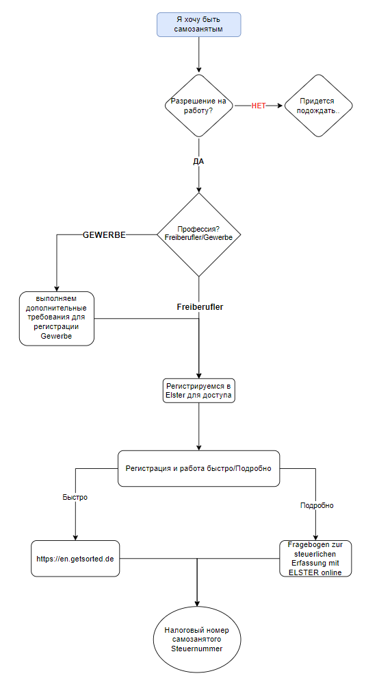

### Кто такие фрилансеры и владельцы Gewerbe в Германии?

В Германии любая деятельность должна быть четко определена и классифицирована, даже если речь идет о самостоятельной работе. В этой системе существуют две основные категории: фрилансеры (Freiberufler) и владельцы Gewerbe. Каждая из этих категорий имеет свои уникальные особенности и требования, регулируемые немецким законодательством.

### Фрилансер (Freiberufler)

Фрилансер в Германии — это специалист, оказывающий профессиональные услуги, не связанные с торговлей или коммерцией. Основное требование — деятельность должна быть интеллектуальной и требовать специальных знаний. К таким профессиям относятся врачи, юристы, консультанты, программисты и другие специалисты. Однако не любая самостоятельная работа подпадает под категорию фрилансера. Деятельность должна быть достаточно интеллектуальной, чтобы немецкое законодательство признало ее таковой. Например, простая починка компьютеров сюда не относится.

Фрилансеры освобождены от регистрации в торговом реестре (Handelsregister) и от обязательного членства в Торгово-промышленной палате (IHK), что значительно упрощает бюрократические процедуры. Однако стоит учитывать, что не всякая деятельность может быть признана фрилансом. Если вы хотите узнать, можете ли вы получить статус Freiberufler, ознакомьтесь с требованиями на сайте IHK: [<u>https://www.ihk.de/emden/recht/gewerberecht/abgrenzung-gewerbe-und-freier-beruf-2353148</u>](https://www.ihk.de/emden/recht/gewerberecht/abgrenzung-gewerbe-und-freier-beruf-2353148)

### Gewerbe (владельцы собственного бизнеса)

Если ваша деятельность не подпадает под категорию "интеллектуальной" по государственным стандартам, то вы становитесь владельцем Gewerbe. Представьте себе классический сценарий: вы открываете магазин, начинаете торговать товарами или предоставлять услуги, такие как ремонт техники, и тем самым становитесь предпринимателем. Это звучит впечатляюще, но требует дополнительных усилий: вам нужно зарегистрироваться в торговом реестре, платить торговый налог и быть готовым к взаимодействию с немецкой бюрократией.

У владельцев Gewerbe есть свои преимущества. Во-первых, у вас есть возможность расширить свою деятельность, нанимать сотрудников и даже привлекать инвестиции. Однако, выбрав этот путь, вы становитесь предпринимателем, а не "свободным художником", как в случае с фрилансером. Если ваша цель — масштабировать бизнес и добиться серьезного роста, то путь владельца Gewerbe для вас.

Так кем же быть? Если вы стремитесь к свободе и гибкости (с определенными налоговыми обязательствами), статус фрилансера может быть идеальным выбором. Однако, если у вас есть амбиции построить и развивать свой бизнес, то мир Gewerbe может открыть перед вами новые возможности.

### Основные различия между фрилансером и владельцем Gewerbe

Одно из ключевых различий — это, конечно, налогообложение. Владелец Gewerbe обязан платить торговый налог (Gewerbesteuer), что добавляет свою долю бюрократических обязанностей и финансовых обязательств. В то время как фрилансеры освобождены от уплаты этого налога. Такое ощущение, что законодатель как бы сказал: "Хорошо, вот вам хотя бы одно послабление, но не стоит расслабляться!

На этом бюрократические особенности не заканчиваются. Фрилансеры получают еще одно преимущество — более упрощенную систему отчетности и бухгалтерии. Им не нужно проводить долгие ночи за калькулятором и таблицами. Отчеты и налоговые декларации фрилансеров в Германии говорят: "Мы облегчим вам задачу, но всё же придется поработать." В отличие от них, владельцы Gewerbe обязаны вести подробный учет, заполнять множество документов и подавать ежегодную декларацию о торговом налоге. Это своего рода "хардкорный" режим ведения бизнеса.

Важно помнить, что процесс регистрации Gewerbe может значительно отличаться в зависимости от специфики вашей деятельности. Поэтому, если вы решите погрузиться в этот мир, стоит внимательно ознакомиться с информацией и рекомендациями по данному вопросу.:

[<u>https://www.lexoffice.de/wissenswelt/selbstaendig-machen/gewerbe-anmelden/</u>](https://www.lexoffice.de/wissenswelt/selbstaendig-machen/gewerbe-anmelden/)

[<u>https://www.ihk.de/karlsruhe/fachthemen/recht/gewerberecht/gewerbeanmeldung-4632354</u>](https://www.ihk.de/karlsruhe/fachthemen/recht/gewerberecht/gewerbeanmeldung-4632354)

Таким образом, если вы стремитесь к контролю и готовы к сложностям с отчетностью, мир Gewerbe может стать вашим выбором. А если вы предпочитаете более простой путь, но с некоторыми "острыми" моментами, фриланс, вероятно, больше вам подойдет.

### Регистрация в Elster

**Важно:** одним из фундаментальных требований для начала всего процесса является доступ к личному кабинету финансовой службы — Finanzamt. Через этот кабинет можно подать заявку на фриланс, официально общаться с Finanzamt, подавать налоговые декларации, а также делегировать доступ Steuerberater'у. Подробная инструкция приведена ниже.

1.  Заходим на [<u>https://www.elster.de/eportal/registrierung-auswahl?locale=en_US</u>](https://www.elster.de/eportal/registrierung-auswahl?locale=en_US)

2.  Нажимаем **Next**

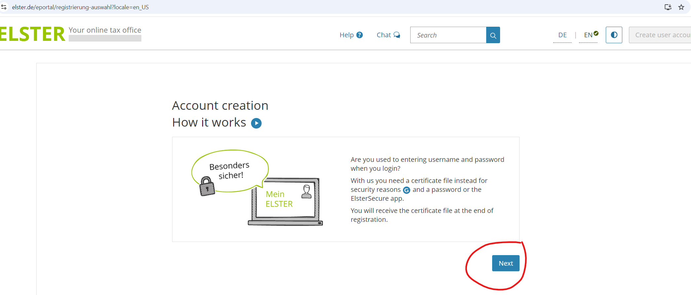

3.  Нажимаем **Next**

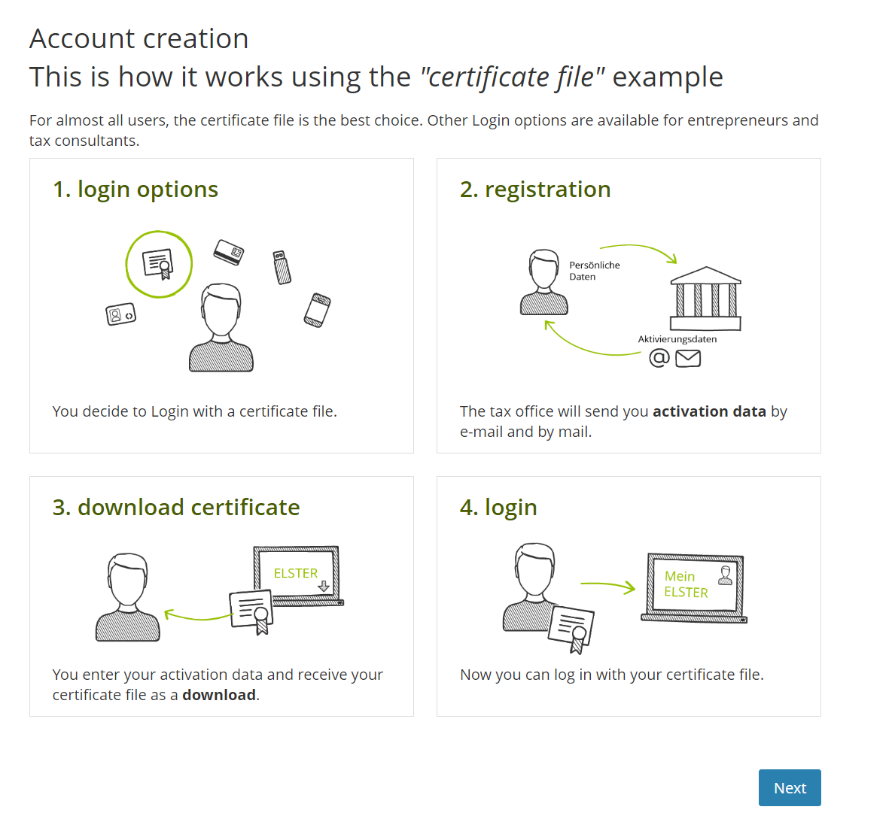

4.  Выбираем раздел **Certificate file** и нажимаем **Select**

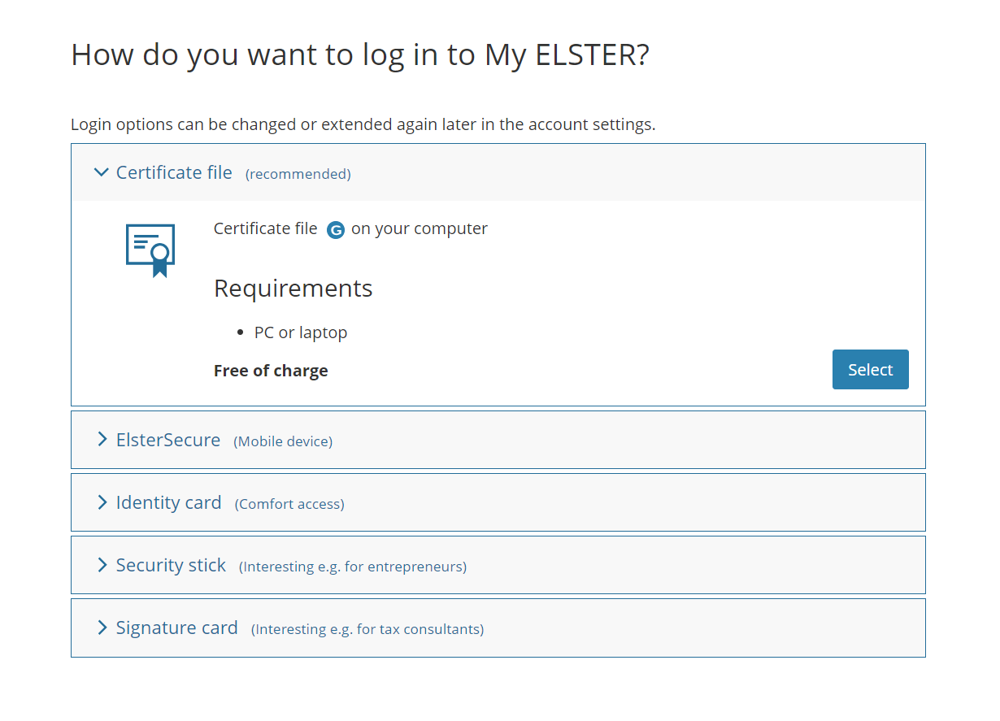

5.  Выбираем **For me ( and my parther)** нажимаем Next

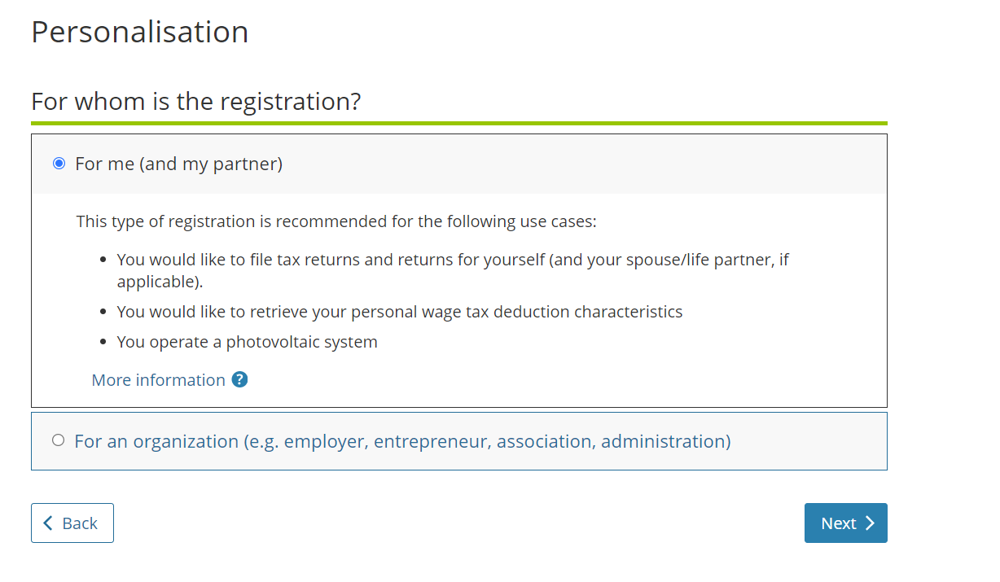

6.  Выбираем **With tax identification number**

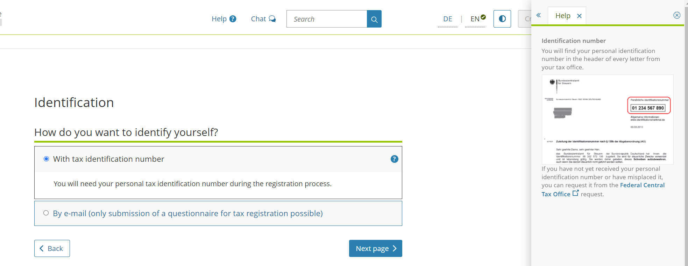

7.  Вводим свои данные разделе **Data Entry** и ставим галочку внизу ( **I confirm**) нажимаем **Next**

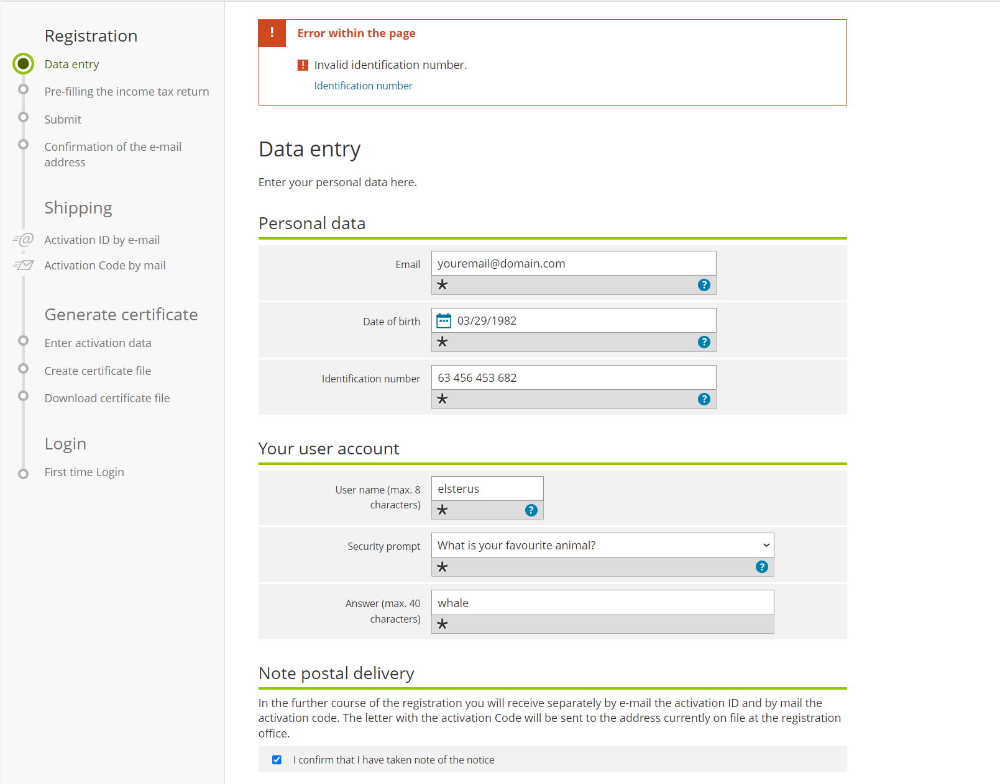

8.  Заполнить **Pre-filling the income tax return** :

Если вы хотите использовать один и тот же аккаунт совместно с вашим супругом или детьми, вы можете добавить здесь их налоговые идентификационные номера. Elster сохраняет данные, которые вы указываете в вашей налоговой декларации, и автоматически заполняет, например, основные формы в следующем году. Если ваши данные к тому моменту изменятся, вы, конечно, сможете их отредактировать. В любом случае, это сэкономит вам время и позволит видеть, какие данные вы подавали в предыдущие годы. Сейчас вы ввели все необходимые данные и можете нажать на кнопку "Проверить", чтобы ещё раз их просмотреть перед отправкой.

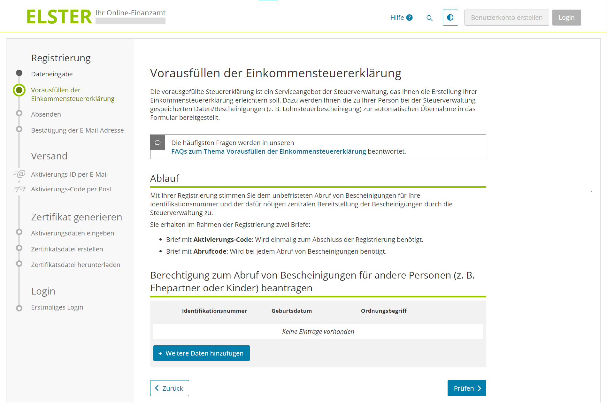

9.  Подтверждение регистрации

Если вы корректно ввели все данные (отмеченные серым цветом), нажмите кнопку "Submit". После этого вы получите электронное письмо для подтверждения введённых данных. Нажмите на ссылку активации, указанную в письме. Если письмо не пришло, подождите немного и проверьте также папку "Спам". Ссылка действительна в течение семи дней. Затем вам придёт ещё одно письмо с инструкциями для активации учётной записи и важным идентификационным номером (ID активации), который необходимо сохранить.

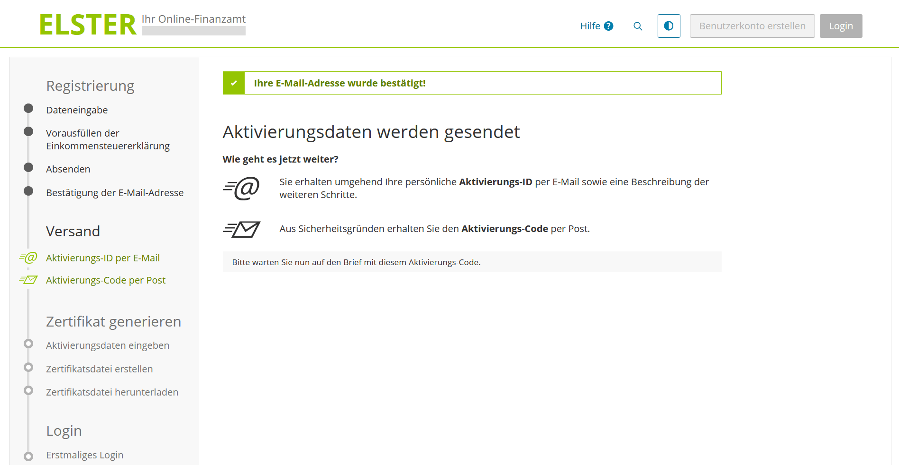

10. Регистрация в **Elster Online**

Как только вы получите письмо с вашим вторым персональным кодом активации, следуйте дальнейшим шагам регистрации. Письмо должно прийти в течение 14 дней. Если оно не поступит, свяжитесь со службой поддержки ELSTER.

В дальнейшем для доступ к личному кабинету потребуется сертификат который вы сохранили во время регистрации + логин и пароль

Важным предварительным условием перед началом процесса регистрации является наличие отдельного счета/IBAN, который вы будете использовать для получения доходов, уплаты налогов и всех возможных расходов, связанных с самозанятостью. *Раздел 6. Банки*

### Быстрая Регистрация Freiberufler

*Примечание: не реклама getsorted.*

1.  Регистрируемся на [<u>https://en.getsorted.de</u>](https://en.getsorted.de)

2.  На главной странице нажимаем Start registration

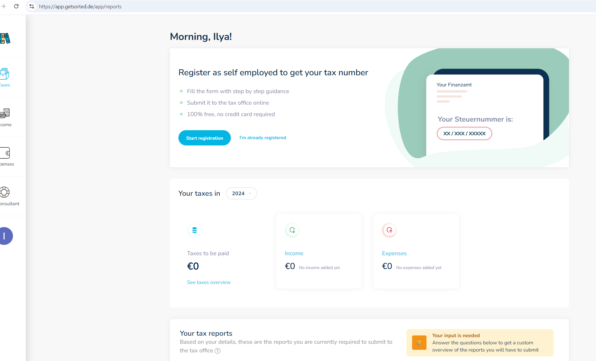

3.  Заполняем стандартную анкету **Personal Details.** Обязательно укажите вашу профессию.

4.  Заполняем **Business Info.** Здесь важно указать вашу профессию, чтобы система правильно определила, являетесь ли вы **Freiberufler** или **Gewerbe.**

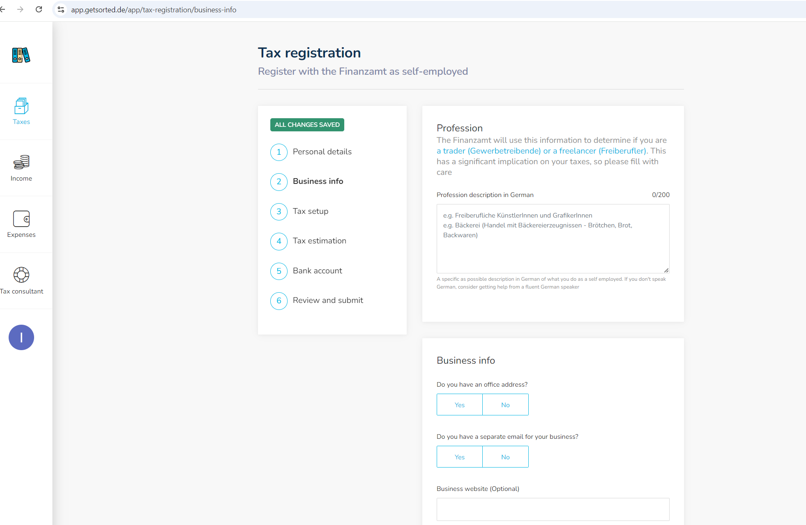

5.  Раздел **Tax Setup.** В пункте **Profit determination method** вы, скорее всего, выберете Single entry bookkeeping. Если ваша выручка превышает 800 тыс. евро в год, тогда выбирается второй вариант.

6.  Раздел **Tax Estimation.** Здесь необходимо указать вашу ситуацию с фрилансом, а также ожидаемые доходы на текущий и следующий год. Я намеренно не привожу деталей, так как у всех разные жизненные ситуации.

Раздел **Bank Account**. Как я уже писал выше, важно чтобы у вас был отдельный счет. Поэтому ставим YES и указываем IBAN.

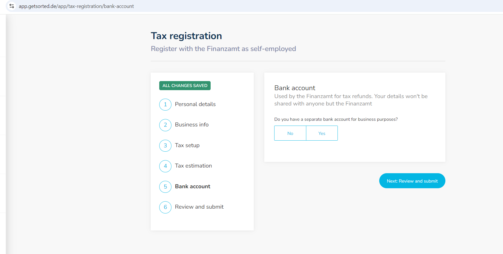

7.  Раздел **Review and Submi**t. В этом разделе нужно указать офис Finanzamt региона где вы проживаете и нажать **Submit to the Finanzamt**.

### Подробная регистрация

Подробная регистрация предполагает, что вы входите в личный кабинет **Elster** и там заполняете онлайн-формуляр «**Fragebogen zur steuerlichen Erfassung**».

Могу порекомендовать два подробных видео по заполнению формуляра:

- На русском от **Tupa Germania**:

[<u>https://www.youtube.com/watch?v=S9eyTPUcp1s</u>](https://www.youtube.com/watch?v=S9eyTPUcp1s)

- На немецком от **Steuerfit**:

[<u>https://www.youtube.com/watch?v=Uqe_tQvaILg&t=1s</u>](https://www.youtube.com/watch?v=Uqe_tQvaILg&t=1s)

**Видео по регистрации Gewerbe (на немецком)**

Для Баварии

[Gewerbe anmelden - Gewerbeschein beantragen: Schritt-für-Schritt Anleitung für Anfänger](https://www.youtube.com/watch?v=nm4kTkUa-44)

Для Берлина

[Gewerbe anmelden - Gewerbeanmeldung ausfüllen: Schritt für Schritt Anleitung 2023](https://www.youtube.com/watch?v=trPRRPUjpNQ)

В зависимости от вашего места жительства и скорости обработки документов, через 2–9 недель на почту вам придет подтверждение регистрации в качестве фрилансера по указанному виду деятельности, а также налоговый номер.

### Чек-лист первых 90 дней фриланса

1. Откройте отдельный счёт/IBAN под деятельность.
2. Зарегистрируйтесь в Elster и сохраните сертификат.
3. Подайте Fragebogen zur steuerlichen Erfassung, выберите KUR/Regelbesteuerung.
4. Настройте учёт (EÜR, хранение чеков/счётов, GoBD, e-Rechnung).
5. Минимальные страховки: Krankenversicherung, Haftpflicht, при необходимости Berufsunfähigkeit.
6. Подготовьте шаблон счёта (DE/EU/вне ЕС) и процесс выписки.
7. Выпишите первый счёт и проверьте реквизиты + текст про НДС/§19 UStG.

## 2. Про налоги

Налоги — это как обязательный "квест" на пути любого фрилансера или владельца бизнеса в Германии. Хоть он и не самый увлекательный, но уж точно необходимый, ведь без его прохождения вас ждут "неприятные сюрпризы" в виде штрафов или вопросов от налоговой службы (а с ней лучше не шутить!). В этой главе мы разберемся с основными видами налогов, которые нужно платить, как фрилансерам, так и владельцам Gewerbe, чтобы работать легально и спокойно спать по ночам.

**TL;DR по налогам:**
- Проверьте, кто вы (Freiberufler или Gewerbe) и нужен ли Gewerbeamt.
- Оцените KUR: ≤25 000 € прошлый год и ≤100 000 € текущий — можно без НДС; иначе Regelbesteuerung.
- Voranmeldung: если НДС к уплате за прошлый год > 9 000 € — подача помесячно; 2 000–9 000 € — квартал; ≤ 2 000 € — чаще всего год.
- Einkommensteuer прогрессивно: базовый необлагаемый минимум ~12 096 €, далее прогрессия до 42/45 %.
- При международных сделках: EU B2B — Reverse Charge; вне ЕС — экспорт услуг (§4 Nr.1a UStG).

### Виды налогов для фрилансеров/гевербе
#### Таблица основных налогов

| Налог | Объект | Кому актуален | Ключевые пороги/ставки | Когда сдавать/платить |
| --- | --- | --- | --- | --- |
| Einkommensteuer | Чистая прибыль | Все | Grundfreibetrag ~12 096 €; прогрессия до 42/45% | Годовая декларация, авансы поквартально |
| Umsatzsteuer | Оборот (НДС) | Все, кроме KUR | KUR: ≤25k прошлый, ≤100k текущий; Voranmeldung: >9k/год — месяц | Voranmeldung месяц/квартал; годовая декларация |
| Gewerbesteuer | Прибыль Gewerbe | Только Gewerbe | Freibetrag ~24 500 €; ставка по Gemeinde | Годовая декларация после EÜR/подоходного |
| Solidaritätszuschlag | Доп. сбор к ESt | При высоком ESt | Расчитывается от суммы ESt (см. Bescheid) | Автоматом с ESt |
| Kirchensteuer | Членам церкви | Если состоите | 8–9% от ESt | Автоматом с ESt |

#### 1. Подоходный налог (Einkommensteuer)

Фрилансеры и владельцы Gewerbе, как и все налогоплательщики, обязаны уплачивать подоходный налог. Этот налог рассчитывается на основе чистого дохода — разницы между общими доходами и расходами, связанными с ведением деятельности. Ставка подоходного налога прогрессивна и зависит от суммы дохода (цифры актуальны на 2025 год):

- До 12 096 евро в год — 0 % (Grundfreibetrag).
- 12 097–17 443 евро — прогрессия, входная ставка около 14 % и плавно растёт до ~24 %.
- 17 444–68 480 евро — прогрессия, ставка постепенно доходит до 42 %.
- 68 481–277 825 евро — 42 %.
- Свыше 277 826 евро — 45 %.

Например, при доходе в 80 000 евро налог не составит 42%, как это может показаться по ставке для верхнего диапазона, а будет около 30-35%. Это связано с тем, что только часть дохода выше определенного порога облагается по более высокой ставке. Чтобы точно узнать, сколько процентов налога приходится на весь доход, используется средняя эффективная налоговая ставка, которая всегда будет ниже самой высокой маргинальной ставки.

<https://www.bmf-steuerrechner.de/ekst/eingabeformekst.xhtml>

Пример рассчета:

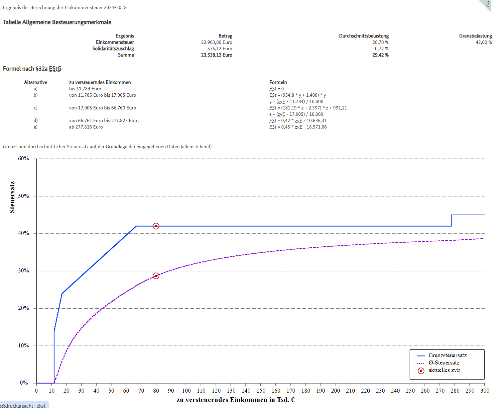

#### 2. Налог на добавленную стоимость (НДС) или Umsatzsteuer

Большинство фрилансеров и владельцев Gewerbе обязаны уплачивать налог на добавленную стоимость (Mehrwertsteuer, или Umsatzsteuer). Общая ставка НДС в Германии составляет 19%, однако для некоторых товаров и услуг, например, книг и большинства продуктов питания, действует пониженная ставка в 7%. Исключения составляют малые предприниматели (Kleinunternehmer), чей годовой оборот не превышает 25 000 евро( c 2025 года) — они могут быть освобождены от уплаты НДС.

#### 3. Торговый налог (Gewerbesteuer)

Фрилансеры освобождены от уплаты торгового налога, который взимается с предприятий, ведущих коммерческую деятельность (Gewerbe). Однако владельцы Gewerbе обязаны уплачивать этот налог, если их годовая прибыль превышает определённый порог (около 24 500 евро). Торговый налог рассчитывается на основании прибыли и зависит от ставки, установленной местными властями. (примерно в диапазоне от 0 до 7%)

#### 4. Кооперативные и корпоративные налоги

Фрилансеры не обязаны уплачивать корпоративный налог (Körperschaftsteuer), который применяется только к капиталовложениям, таким как GmbH, AG или UG. Это позволяет им сэкономить на налогообложении, по сравнению с владельцами компаний.

### НДС (Umsatzsteuer) и особенности его уплаты

Налог на добавленную стоимость (Umsatzsteuer) взимается с большинства товаров и услуг, предоставляемых на территории Германии. Важно знать особенности его уплаты и разбираться в различиях между двумя основными методами расчета НДС: **Soll-Versteuerung** и **Ist-Versteuerung**.

#### 1. Soll-Versteuerung (начисление налога по факту выставления счета)

При данном методе фрилансер обязан уплачивать НДС в момент выставления счета клиенту, вне зависимости от того, был ли счет оплачен. Это может привести к ситуациям, когда налоги приходится платить раньше, чем поступят фактические деньги на счет. Soll-Versteuerung рекомендуется компаниям и бизнесам с высокой ликвидностью.

#### 2. Ist-Versteuerung (налогообложение по факту получения оплаты)

При данном методе НДС уплачивается только тогда, когда клиент фактически оплатил счет. Этот метод помогает фрилансерам лучше управлять своей ликвидностью и снижает риск кассовых разрывов. Чтобы использовать Ist-Versteuerung, необходимо соответствовать определённым критериям, включая годовой оборот менее 800 000 евро (с 01.01.2025).

#### 3. Предварительные налоговые декларации (Umsatzsteuer-Voranmeldung)

Фрилансеры и владельцы Gewerbе обязаны подавать предварительные декларации по НДС (Umsatzsteuer-Voranmeldung) каждый месяц, квартал или год, в зависимости от суммы **начисленного НДС** за предыдущий год:

- Если сумма НДС к уплате за прошлый год **более 9 000 €** (правило 2025) — сдача ежемесячно.
- Если сумма **от 2 000 до 9 000 €** — сдача ежеквартально.
- Если сумма **до 2 000 €** — обычно раз в год (могут полностью освободить от Voranmeldungen).

Важно: речь идёт о сумме налога к уплате, а не о выручке. Подавать декларацию необходимо до 10-го числа месяца, следующего за расчётным периодом.

------------------------------------------------------------------------

#### 4. Авансовые платежи по налогам

Фрилансеры и владельцы Gewerбе обязаны делать авансовые платежи по налогам (Vorauszahlungen), чтобы избежать большой суммы единовременных выплат в конце налогового года. Авансовые платежи определяются на основе оценки предполагаемого дохода, указанного при регистрации, или на основе прошлогодних доходов.

#### 1. Как рассчитываются авансовые платежи?

После регистрации в налоговой службе фрилансеру или владельцу Gewerбе необходимо указать свой прогнозируемый доход на год ( **Einkommensteuervorauszahlung** ). Исходя из этих данных, налоговая служба рассчитывает авансовые платежи по подоходному налогу. Авансовые платежи производятся ежеквартально по следующим датам:

- 10 марта,

- 10 июня,

- 10 сентября,

- 10 декабря.

Фрилансеры или владельцы Gewerbе узнают, сколько подоходного налога им нужно будет заплатить только по окончании года. Чтобы избежать необходимости единовременной уплаты большой суммы налога, они вносят авансовые платежи в течение года. Если ваш прогнозируемый доход изменится в течение года, вы можете запросить корректировку суммы авансовых платежей в налоговой службе.

#### 2. Перерасчёт и окончательная уплата налогов

По окончании года подаётся окончательная налоговая декларация, на основании которой определяется точная сумма налога. Если ваши авансовые платежи превышают фактическую налоговую обязанность, налоговая служба вернёт вам излишне уплаченные налоги. **Рекомендуется заранее откладывать деньги на эти платежи, чтобы они не стали неожиданным сюрпризом.**

Если же налоги были недоплачены, придётся внести оставшуюся сумму в течение месяца после получения налогового уведомления.

------------------------------------------------------------------------

### Оптимизация налогов и ограничения для фрилансеров

Оптимизация налоговой нагрузки — это важный аспект для любого фрилансера, стремящегося снизить свои расходы. В Германии существует несколько законных способов оптимизации налогов, однако важно понимать, что любое отклонение от законодательства может привести к штрафам и дополнительным проверкам со стороны налоговых органов. Основной принцип все, что связано с профессиональной деятельностью и имеет документальное подтверждение, может быть вычтено из налоговой базы. Важно следить за сохранностью всех счетов и документов, а также учитывать сроки подачи налоговой отчетности.

Как фрилансеру, важно знать, какие расходы можно списать с налогов, чтобы снизить налогооблагаемую базу и платить меньше налогов. Однако не все расходы можно списать полностью, а для некоторых из них действуют ограничения. В этой статье мы рассмотрим, какие расходы фрилансер может списать и как это сделать правильно, чтобы оптимизировать налоговые отчисления и избежать проблем с налоговой инспекцией.

#### Что такое списание расходов?

Списание расходов — это процесс уменьшения налогооблагаемой базы (той суммы, с которой рассчитываются налоги) за счёт учёта расходов, которые были сделаны для ведения вашей профессиональной деятельности. Например, если вы купили компьютер для работы, его стоимость можно списать с доходов. Списание расходов помогает снизить сумму налогов, которые вам нужно будет заплатить.

#### Какие расходы можно списать полностью?

Полное списание означает, что вы можете учесть 100% расходов для уменьшения своей налогооблагаемой прибыли. Такие расходы включают аренду офиса, расходы на офисные принадлежности, оплату страховых полисов, профессиональные консультации и некоторые виды командировочных расходов. Эти расходы напрямую связаны с вашей профессиональной деятельностью и полностью признаются как производственные расходы.

Примеры полностью списываемых расходов:

- **Аренда офиса (Büromiete)**: Если вы арендуете отдельное помещение для работы, то эти расходы можно списывать полностью.

- **Офисные принадлежности (Bürobedarf)**: Покупка бумаги, ручек, папок и других материалов для работы также списывается на 100%.

- **Страхование (Versicherungen)**: Профессиональные страховки, такие как страхование предпринимательской ответственности и адвокатская страховка, раздел предпринимательской ответственности, полностью списываются.

- **Бухгалтерские услуги (Beratungskosten)**: Консультации по вопросам налогообложения и бухгалтерии, а также другие юридические услуги.

#### Какие расходы частично списываются?

Частичные расходы — это такие расходы, которые можно списать только в определенной доле, так как они могут иметь как профессиональное, так и личное использование. Например, если вы устраиваете деловые ужины с клиентами, налоговое законодательство позволяет списать только 70% таких расходов, поскольку считается, что 30% связаны с личным элементом.

Примеры частично списываемых расходов:

- **Представительские расходы (Bewirtungskosten)**: Вы можете списать только 70% от чистой суммы, но НДС по этим расходам можно вернуть полностью. Например, если вы организуете деловую встречу за ужином с клиентом, только 70% стоимости этого ужина можно списать как производственные расходы.

- **Использование личного автомобиля для работы**: Если вы используете свой личный автомобиль для работы, то вы можете списать только ту часть, которая соответствует рабочим поездкам. Остальные расходы, связанные с личным использованием, не списываются.

#### Какие расходы списываются только по НДС (VAT) Abzug nur der MwSt?

Некоторые покупки, такие как оборудование или транспортные средства, можно списать с учётом НДС, который вы заплатили при покупке. Однако стоимость самого оборудования может быть списана не сразу, а частями через амортизацию (Abschreibung, AfA). Это особенно важно для крупных покупок, таких как компьютер или автомобиль, которые используются в бизнесе.

#### Ограничения по списанию налогов

Есть определённые расходы, которые нельзя списать полностью или которые имеют лимиты. Например:

- **Подарки клиентам (Geschenke an Kunden)**: Если стоимость подарка превышает 50 евро, такие подарки нельзя списать с налогов.

- **Расходы на питание в командировках (Verpflegungsmehraufwendungen)**: Эти расходы могут быть списаны только в рамках установленных налоговой инспекцией норм. В Германии действуют суточные нормы: 14 евро за день при поездках продолжительностью от 8 до 24 часов внутри страны, и 28 евро — при более длительных поездках. В других странах нормы могут быть выше.

#### Как оптимизировать налоговые отчисления?

1.  **Ведите учёт всех расходов.** Сохраняйте все квитанции и чеки, связанные с вашей профессиональной деятельностью, чтобы легко подтвердить расходы перед налоговой инспекцией.

2.  Используйте амортизацию для крупных покупок( AFA Tabelle)

Ссылка на таблицы [<u>https://www.bundesfinanzministerium.de/Web/DE/Themen/Steuern/Steuerverwaltungu-Steuerrecht/Betriebspruefung/AfA_Tabellen/afa_tabellen.html</u>](https://www.bundesfinanzministerium.de/Web/DE/Themen/Steuern/Steuerverwaltungu-Steuerrecht/Betriebspruefung/AfA_Tabellen/afa_tabellen.html)

Если вы купили дорогостоящее оборудование, такое как компьютер или принтер, вы можете списывать его стоимость частями на протяжении нескольких лет. Это позволит снизить налогооблагаемую базу на длительный срок.

3.  **Разделяйте личные и рабочие расходы.** Если вы используете автомобиль, телефон или компьютер как для работы, так и для личных нужд, ведите учёт того, сколько времени или ресурсов используется для профессиональной деятельности. Это поможет избежать проблем при налоговых проверках.

4.  **Консультируйтесь с бухгалтером.** Профессиональный бухгалтер или налоговым консультантом поможет вам правильно распределить расходы и воспользоваться всеми возможностями для налоговой оптимизации.

#### Таблица расходов

Ниже приведена таблица, которая показывает, какие расходы можно списать полностью, а какие позволяют списать только НДС (VAT):

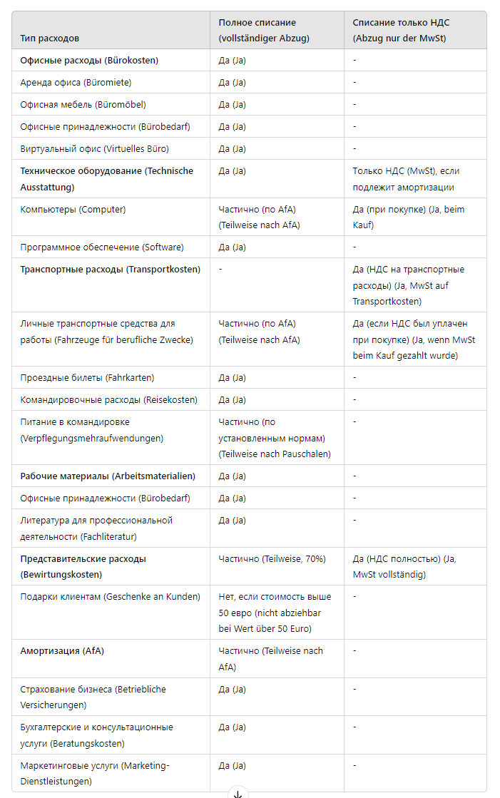

### Автомобиль для работы

Когда фрилансеры или другие самозанятые используют служебный автомобиль для личных целей, это считается **денежной выгодой (geldwerter Vorteil)**, которую необходимо обложить налогом. Немецкая налоговая служба позволяет использовать две основные методики для расчета частного использования автомобиля: **метод ведения путевого листа (Fahrtenbuchmethode)** и **метод 1% (1-Prozent-Methode)**. Ниже подробно описано, как эти методы работают и какие факторы следует учитывать при их выборе.

#### Vorsteuer с расходов на автомобиль

- Если у вас есть право на Vorsteuerabzug, вы можете полностью вычесть НДС с расходов на автомобиль, таких как топливо, ремонт и обслуживание.

- Например, если общие расходы составляют 9 450 евро, включая НДС (что соответствует примерно 7 941 евро без НДС и 1 509 евро НДС), вы можете вернуть эти 1 509 евро в рамках Vorsteuer.

#### НДС на частное использование

- Когда рассчитывается доля частного использования, с неё необходимо заплатить НДС. Например, в случае путевого листа:

  - 1 928 евро (частное использование) = чистая сумма.

  - 1 928 \* 19% = 366,32 евро (НДС на частное использование), который нужно вернуть государству.

#### 1. Метод ведения путевого листа (Fahrtenbuchmethode)

Этот метод требует от фрилансеров фиксировать каждую поездку, связанную с работой, с указанием следующих данных:

- Дата поездки.

- Начальный и конечный пункты поездки.

- **Показания одометра** на момент начала и конца поездки.

- **Цель поездки** и, если применимо, имя клиента или партнера.

##### Преимущества метода ведения путевого листа

- Подходит для тех, кто редко использует автомобиль в личных целях, так как расчет частного использования будет минимальным.

- Если автомобиль старый или уже списан, ведение путевого листа часто выгоднее, чем метод 1%.

##### Недостатки

- Требуется тщательное и регулярное ведение записей. Любые ошибки или пробелы могут привести к отказу налоговой службы признать этот метод действительным.

- Ведение путевых листов вручную может быть трудоемким, но существуют электронные решения, такие как GPS-устройства и приложения для путевых листов, которые делают этот процесс проще.

#### 2. Метод 1% (1-Prozent-Methode)

Этот метод позволяет фрилансеру вычислить частное использование автомобиля на основе **1% от брутто-листовой стоимости автомобиля** (Brutto-Listenpreis) в месяц. Существуют также вариации этого метода для электромобилей, где используется 0,5% или 0,25%.

##### Преимущества метода 1%

- Метод прост в использовании и не требует ведения путевых листов.

- Удобен, если автомобиль часто используется в личных целях, или если автомобиль новый и имеет высокую листовую стоимость.

##### Недостатки

- Если автомобиль старый, этот метод может быть менее выгодным, так как расчет ведется на основе первоначальной стоимости автомобиля, а не его текущей рыночной стоимости.

- Более высокий налог за личное использование, особенно если автомобиль редко используется для личных поездок.

##### Пример расчета

##### Пример расчета методом ведения путевого листа

Допустим, общие расходы на автомобиль составили 9 450 евро в год. Вы проехали 24 500 км, из которых 19 500 км были связаны с деловыми поездками, а 5 000 км — это частные поездки.

- *9 450 евро \* (5 000 км / 24 500 км) = **1 928 евро** — это сумма, подлежащая налогообложению за частное использование.*

##### Пример расчета методом 1%

Предположим, брутто-листовая стоимость автомобиля составляет 35 000 евро. По методу 1% ваш частный расход составит:

*35 000 евро \* 1% \* 12 месяцев = 4 200 евро — это сумма за частное использование автомобиля.*

#### 3. Корректировки: поездки на работу (Fahrt zur ersten Betriebsstätte)

Если вы используете автомобиль для поездок на работу (например, из дома в офис), вам необходимо добавить 0,03% от брутто-листовой стоимости за каждый километр пути. Например, при расстоянии в 10 км и стоимости автомобиля 35 000 евро, вы добавляете:

- *0,03% \* 10 км \* 12 месяцев = **1 260 евро**.*

Эта сумма добавляется к частным расходам, но вы также можете списать компенсацию за поездки на работу (Pendlerpauschale) по 0,30 евро за километр.

#### 4. Налоговые льготы для электромобилей

Для электромобилей и гибридов действуют различные налоговые льготы. Например, для автомобилей, приобретенных с 2019 года, можно использовать **0,25% от брутто-листовой стоимости**, если автомобиль имеет нулевые выбросы CO2 и его цена не превышает 60 000 евро.

#### Пример расчета для электромобиля:

Предположим, ваш электромобиль стоит 52 000 евро и был приобретен в 2020 году. Используя 0,25% метод, ваши частные расходы составят:

- *(52 000 евро \* 0,25%) \* 12 месяцев = **1 560 евро**.*

#### 9. Заключение: как выбрать между Fahrtenbuch и 1-Prozent-Methode?

- **Ведение путевого листа** выгодно, если у вас мало частных поездок или автомобиль старый.

- **Метод 1%** удобен для тех, кто часто использует автомобиль для личных нужд или если автомобиль новый с высокой листовой стоимостью.

Каждая ситуация индивидуальна, и выбор метода зависит от множества факторов. Рекомендуется проконсультироваться с бухгалтером или налоговым консультантом, чтобы выбрать наиболее выгодный вариант и не ошибить в рассчетах.

### Личный автомобиль для работы

Фрилансеры в Германии могут использовать личные автомобили для рабочих нужд и при этом списывать связанные с этим расходы с налогов. Это может значительно снизить налоговые обязательства, если правильно учесть все нюансы. В этой статье мы рассмотрим, как фрилансеру грамотно использовать личный автомобиль для работы и какие налоговые льготы можно при этом получить.

#### 1. Правовые основы списания расходов

Когда фрилансер использует личный автомобиль для выполнения рабочих задач, такие поездки могут быть признаны профессиональными, и связанные с ними расходы можно учесть как затраты на ведение бизнеса. Однако важно разделить рабочие и личные поездки, так как налоговые органы требуют точного учета. В случае неправильного учета фрилансеру могут отказать в списании части расходов.

#### 2. Как разделить личное и профессиональное использование автомобиля

Чтобы разделить рабочие и личные поездки, необходимо вести журнал поездок (Fahrtenbuch). Это обязательное требование, если вы планируете списывать фактические расходы. В журнале должны фиксироваться следующие данные:

- Дата поездки

- Цель поездки

- Место назначения

- Пройденное расстояние (в километрах)

- Время в пути

Этот журнал служит доказательством доли служебного использования автомобиля и используется для расчета пропорциональной части расходов, которую можно списать с налогов.

#### 3. Методы учёта расходов

Есть два основных метода для списания расходов на автомобиль:

1.  **Фактические расходы.** Этот метод требует, чтобы вы фиксировали все реальные затраты на автомобиль, которые связаны с его эксплуатацией: топливо, техническое обслуживание, страхование, налог на транспортное средство, амортизацию, и даже парковку. Затем эти расходы делятся пропорционально между личным и рабочим использованием на основании журнала поездок. Это наиболее выгодный вариант, если вы часто используете автомобиль для работы.

2.  **Фиксированная ставка на километр.** Если вам сложно вести учет всех расходов, можно воспользоваться упрощенным методом — списывать 30 центов за каждый километр, проезжаемый в рабочих целях. Для этого также потребуется вести журнал поездок, но учет отдельных затрат на автомобиль не обязателен.

#### 4. Регистрация автомобиля на компанию

Если автомобиль зарегистрирован на компанию, все расходы на его эксплуатацию, включая покупку, страхование и техобслуживание, можно учесть как корпоративные затраты. Однако важно понимать, что автомобиль становится активом компании, что накладывает определенные обязательства. Например, вам придется учитывать амортизацию автомобиля и правильно рассчитывать его использование для личных нужд.

Кроме того, если вы используете автомобиль как для бизнеса, так и для личных целей, налоговые органы могут рассматривать использование автомобиля для личных нужд как дополнительное вознаграждение, которое также подлежит налогообложению.

#### 5. Амортизация и снижение стоимости

Амортизация автомобиля — это процесс постепенного списания его стоимости в течение нескольких лет. В зависимости от стоимости автомобиля и предполагаемого срока его эксплуатации, фрилансер может списывать часть стоимости ежегодно. Этот метод особенно полезен, если вы купили автомобиль специально для бизнеса или используете его преимущественно в рабочих целях.

#### Пример расчета

Допустим, фрилансер использует личный автомобиль, который эксплуатируется как для личных, так и для рабочих целей. Фрилансер ведет журнал поездок и определяет, что 60% пробега автомобиля связано с рабочими поездками. Рассмотрим два сценария — расчет по фактическим расходам и по фиксированной ставке за километр.

- Общие расходы на автомобиль за год:

  - Топливо: 1500 евро

  - Страхование: 600 евро

  - Техническое обслуживание: 300 евро

  - Прочие расходы: 200 евро

  - Всего: 2600 евро

- **Метод фактических расходов:**  
  Из общих расходов 60% связано с рабочими поездками, значит, можно списать:  
  *2600×0,60=1560 евро*

- **Метод фиксированной ставки:  **
  Фрилансер проехал за год 8000 км в рабочих целях. С учетом фиксированной ставки 30 центов за километр:  
  *8000×0,30=2400 евро*

Как видно из примера, метод фиксированной ставки позволяет списать больше средств, но в зависимости от ситуации с фактическими расходами, этот метод может не всегда быть выгоден. Фрилансеру стоит проанализировать свои затраты и выбрать наиболее подходящий вариант.

### Kinderfreibetrag: налоговое облегчение для родителей

Воспитание детей — это не только радость, но и существенные финансовые затраты. Чтобы поддержать родителей, государство предоставляет налоговые вычеты, одним из которых является **Kinderfreibetrag** — вычет на ребенка, предусмотренный в соответствии с § 32 Einkommensteuergesetz (EStG). Этот вычет уменьшает налогооблагаемую базу, что приводит к снижению налоговой нагрузки для родителей.

#### Основные моменты о Kinderfreibetrag:

1.  Размер Kinderfreibetrag:

    - В 2023 году вычет составляет **8 952 евро** на ребенка.

    - В 2024 году сумма увеличивается до **9 540 евро** на ребенка.

    - В 2025 году сумма увеличивается до **9 600 евро** на ребенка.

Этот вычет включает в себя два компонента: **Freibetrag für das Existenzminimum des Kindes** (вычет на обеспечение минимальных потребностей ребенка) и **Freibetrag für den Betreuungs-, Erziehungs- und Ausbildungsbedarf** (вычет на уход, воспитание и образование).

2.  Для кого доступен Kinderfreibetrag:

    - Kinderfreibetrag предоставляется только налогоплательщикам, находящимся в **налоговых классах I-IV**.

    - **Совместно проживающие родители** подают заявление на вычет вместе и получают полную сумму.

    - **Раздельно проживающие родители** могут разделить Kinderfreibetrag пополам, каждый из них получает 50% от общей суммы.

3.  **Выбор между Kinderfreibetrag и Kindergeld**: Важно помнить, что родители могут выбрать либо **Kindergeld** (ежемесячные выплаты на ребенка), либо **Kinderfreibetrag**. Использовать одновременно оба варианта нельзя. Решение о том, что выгоднее для родителей, принимает налоговая служба на основе так называемой **Günstigerprüfung** (проверка, что более выгодно). Как правило, вычет на ребенка становится более выгодным, если годовой доход превышает **64 000 евро** для семейных пар или **32 000 евро** для одиноких родителей.

4.  **Как получить Kinderfreibetrag**: Чтобы воспользоваться Kinderfreibetrag, его необходимо указать при подаче налоговой декларации. Налоговая служба проведет расчет и сообщит в налоговом уведомлении (Steuerbescheid), что оказалось более выгодным: Kinderfreibetrag или Kindergeld.

#### Дополнительный вычет: Ausbildungsfreibetrag

Если ваш ребенок старше и находится на обучении или в университете, вы можете также получить **Ausbildungsfreibetrag**. Этот вычет предназначен для покрытия расходов, связанных с обучением детей.

- До 2022 года Ausbildungsfreibetrag составлял **924 евро** в год.

- С 2023 года сумма увеличилась до **1 200 евро** в год.

Этот вычет предоставляется в дополнение к Kinderfreibetrag, если у вас все еще есть право на получение Kindergeld на ребенка, который находится в процессе обучения.

#### Пример использования Kinderfreibetrag

Предположим, у вас один ребенок, и вы решили воспользоваться Kinderfreibetrag в 2024 году:

1.  **Размер вычета**: 9 540\* евро будет вычтено из вашей налогооблагаемой базы.

2.  **Снижение налога**: Если вы платите налог по ставке 30%, это снизит вашу налоговую нагрузку на **примерно 2 862 евро** (30% от 9 540 евро).

**\*2025 Год**: 9 600 евро

Если ваш доход превышает порог для Kindergeld, Kinderfreibetrag может предоставить вам значительное налоговое преимущество.

------------------------------------------------------------------------

### Как учитывать расходы и сохранять чеки?

Для того чтобы все эти расходы были приняты налоговыми органами, необходимо правильно документировать их. Каждую покупку или оплату услуг следует сопровождать чеком или счетом, где должны быть указаны дата, сумма, описание покупки и название компании-продавца. Все документы нужно хранить в GoBD-конформном виде: обычно 6–10 лет (для Buchungsbelege часто указывают 8 лет с 2025), чтобы в случае налоговой проверки иметь доказательства.

#### Таблица сроков хранения (Aufbewahrungsfristen)

| Документ | Срок хранения | Комментарий |
| --- | --- | --- |
| Счета/акты (Buchungsbelege, e-Rechnung XML) | 8–10 лет | Хранить оригинал файла/бумаги, GoBD |
| Деловая переписка (торговые письма) | 6 лет | Входящие/исходящие, относящиеся к сделкам |
| Налоговые декларации/решения (Bescheide) | 10 лет | До истечения сроков давности |
| Банковские выписки | 10 лет | Включая PDF/CSV, GoBD |
| Договоры | 6–10 лет | В зависимости от налоговой значимости |

------------------------------------------------------------------------

### Упрощённые вычеты (Постоянные паушальные суммы)

Некоторые расходы можно списывать без предоставления чеков и документов, если используется система паушальных вычетов. Например, паушальная ставка на использование домашнего офиса составляет 6 евро за каждый рабочий день, проведенный дома, но не более 1260 евро в год ( на 2024 год). Существуют и другие паушальные ставки, например, на небольшие расходы на офисные принадлежности.

###  Применение системы Kleinunternehmerregelung
**Кратко:**
- Лимиты: ≤25 000 € нетто прошлый год и ≤100 000 € нетто текущий.
- Превысили 100 000 € в текущем году — сразу переходите на НДС с «перебившего» счета.
- Складывайте все виды деятельности, уведомляйте Finanzamt и клиентов при переходе.

С 2025 года в Германии действуют новые лимиты для малых предпринимателей (§ 19 UStG):

- до 25 000 € **нетто** оборота за **прошлый** календарный год;
- до 100 000 € **нетто** прогнозируемого оборота в **текущем** году; при превышении этого лимита переход на обычный НДС происходит **немедленно**, начиная с счета, который «перебил» 100 000 €.

Учитываются все виды вашей деятельности суммарно (услуги + продажа товаров и т.п.). Если в середине года вышли за 100 000 €:

1. Счета, превысившие лимит, выставляйте уже с НДС и переходите на Regelbesteuerung.
2. Проверьте действующие договоры и уведомите клиентов о смене ставки.
3. Сообщите в Finanzamt и корректно подавайте декларации с учётом НДС.

За деталями удобнее всего свериться с BMF или IHK, либо уточнить у налогового консультанта.

### Учёт амортизации активов

Фрилансеры могут учитывать амортизацию крупных приобретений (например, компьютеров, офисной мебели, оборудования) в течение нескольких лет. Это позволяет равномерно распределить налоговые вычеты на несколько налоговых периодов.

### Применение Europäische Kleinunternehmerregelung с 2025 года

С 1 января 2025 года вводится европейская спецрежим для малых предпринимателей (EU-KUR). Его цель — упростить жизнь небольшим бизнесам, работающим с клиентами по всему ЕС, но он не означает единый «личный» лимит 85 000 €.

#### Что меняется

- **85 000 €** — верхний потолок, до которого страны ЕС могут устанавливать свои национальные пороги. Это не автоматический лимит для каждого фрилансера.
- В Германии учитываются три величины сразу:
  1. национальный лимит § 19 UStG (25 000 € нетто за прошлый год и до 100 000 € нетто в текущем году);
  2. **Unionsgrenze 100 000 €** — общий оборот по всем странам ЕС;
  3. лимит страны покупателя (но не выше 85 000 €), если продаёте B2C в другую страну ЕС (нужно смотреть конкретный национальный порог страны клиента).

#### Как применять на практике

- Зарегистрироваться через BZSt и получить KU-Id, затем подавать квартальные отчёты в рамках EU-KUR.
- Следить, чтобы выполнялись все три лимита. При превышении — переход на обычную систему НДС с момента превышения и, при необходимости, регистрация в стране покупателя.
- Покупательский лимит важен прежде всего при B2C-продажах в другие страны ЕС: например, если продаёте частным клиентам во Франции, смотрите французский порог (но не выше 85 000 €); при его превышении готовьтесь к регистрации во Франции или к отказу от EU-KUR.

#### Кому это актуально

- тем, кто продаёт B2C в другие страны ЕС и хочет избежать отдельных НДС-регистраций, пока обороты по странам невелики;
- если работаете только с немецкими клиентами или по B2B с VAT-номером, чаще всего достаточно национальной Kleinunternehmerregelung;
- неактуально, если уже планируете превышать пороги страны клиента — проще сразу идти в обычный НДС/OSS.

### Быстрый блок по налогам (FAQ)

- **Где платить Gewerbesteuer?** Только при регистрации Gewerbe и прибыли выше Freibetrag (~24 500 €), ставка зависит от Gemeinde.
- **Нужно ли Voranmeldung, если НДС к уплате < 2 000 €?** Обычно освобождают от преддеклараций, сдаёте годовую.
- **Когда подавать Voranmeldung?** До 10-го числа месяца после периода (месяц/квартал).
- **Что с Soli/Kirchensteuer?** Soli платится при высоких доходах, Kirchensteuer — если состоите в церкви (обычно 8–9 % от Einkommensteuer).

### Калькулятор налогов

В дополнение к теории ссылка на **калькулятор налогов**:

[<u>https://www.bmf-steuerrechner.de/ekst/eingabeformekst.xhtml</u>](https://www.bmf-steuerrechner.de/ekst/eingabeformekst.xhtml)

[<u>https://www.steuertipps.de/service/rechner/einkommensteuer-rechner?srsltid=AfmBOopS24R43CYbWcUUJI2sR2hsVbgJKObMVeehVly36oKFrAoSClO8/</u>](https://www.steuertipps.de/service/rechner/einkommensteuer-rechner?srsltid=AfmBOopS24R43CYbWcUUJI2sR2hsVbgJKObMVeehVly36oKFrAoSClO8/)

### Налоговый консультант

Ведение налоговых дел в Германии может оказаться сложной задачей для большинства людей, особенно если речь идет о частных предпринимателях, фрилансерах или владельцах бизнеса. Именно здесь на помощь приходит налоговый консультант (Steuerberater). В этой статье мы рассмотрим, почему важно обращаться к специалистам, в каких ситуациях это необходимо, как правильно выбрать специалиста, а также поделимся полезными ресурсами для поиска налогового консультанта в Германии. Не обязательно искать русско/англоязычного консультанта посколько в основном общение происходит в письменной форме и все ваши запросы вы сможете спокойно и не спеша перевести через Deepl / ChatGPT

#### 1. Кто такой налоговый консультант и какие услуги он оказывает?

Налоговый консультант — это лицензированный специалист, который помогает частным лицам и компаниям разбираться с налоговыми вопросами. В Германии налоговые консультанты обязаны быть членами налоговой палаты (Steuerberaterkammer) и проходить строгую профессиональную сертификацию.

Услуги налогового консультанта могут включать:

- Составление и подача налоговых деклараций (как для физических лиц, так и для компаний);

- Консультирование по вопросам налогового планирования и оптимизации;

- Составление бухгалтерских отчетов для компаний;

- Поддержка в налоговых спорах и разбирательствах;

- Сопровождение во время налоговых проверок (Betriebsprüfung);

- Помощь в налоговом учете для самозанятых лиц, фрилансеров и малых бизнесов.

#### 2. Когда нужно обращаться к налоговому консультанту?

Некоторым категориям граждан стоит особенно серьезно рассмотреть возможность сотрудничества с налоговым консультантом. Вот несколько случаев, когда помощь налогового консультанта может быть необходима:

- **Фрилансеры и частные предприниматели:** Работа на себя подразумевает необходимость самостоятельного учета всех доходов и расходов, а также регулярную подачу налоговых отчетов. Даже небольшая ошибка может привести к штрафам. Налоговый консультант поможет организовать бухгалтерию, учесть все налоговые льготы и избежать ошибок при заполнении налоговой декларации.

- **Владельцы бизнеса:** Ведение бухгалтерии и налоговой отчетности для компаний является сложной и ответственной задачей. Налоговый консультант поможет избежать ошибок, оптимизировать налоги и убедиться, что все финансовые операции соответствуют законодательству.

- **Работа с инвестициями или доходами за рубежом:** Если у вас есть доходы из других стран или вы инвестируете в международные проекты, налоговая ситуация становится сложнее. Консультант поможет правильно декларировать такие доходы, учесть особенности международного налогообложения и избежать двойного налогообложения.

- **Продажа недвижимости или сдача ее в аренду:** В этих случаях возможны различные налоговые льготы и исключения, которыми можно воспользоваться, но только при грамотном подходе. Налоговый консультант подскажет, как правильно учесть доходы от аренды или продажи недвижимости, чтобы минимизировать налоговые обязательства.

- **Налоговая проверка:** Если вас ожидает проверка налоговых органов, консультация профессионала может значительно облегчить процесс и защитить ваши интересы. Налоговый консультант подготовит все необходимые документы, разъяснит налоговым органам спорные моменты и поможет минимизировать возможные риски и штрафы.

### Когда можно обойтись без налогового консультанта?

Несмотря на все преимущества работы с налоговым консультантом, есть ситуации, когда можно справиться самостоятельно и сэкономить на его услугах:

- **Низкий или нерегулярный доход:** Если ваш доход от фриланса невелик (например, менее 20 000 евро в год) или нерегулярен, и ваша налоговая ситуация достаточно проста, можно обойтись без налогового консультанта. В этом случае расходы на услуги профессионала могут быть несоразмерно высоки по сравнению с потенциальной экономией на налогах. Для самостоятельной подачи декларации можно использовать онлайн-сервисы и бесплатные программы, которые помогут учесть основные доходы и расходы.

- **Стандартные налоговые вычеты:** Если вы претендуете только на стандартные налоговые вычеты (например, транспортные расходы, рабочие инструменты, стандартные страховки), то вам, вероятно, не потребуется профессиональная помощь для подачи декларации. Стандартные вычеты легко указываются в декларации и не требуют сложных расчетов.

- **Использование налогового программного обеспечения:** Сегодня существует множество программ для подготовки и подачи налоговых деклараций, которые могут быть полезны для частных лиц с несложной налоговой ситуацией. Такие программы обычно предлагают пошаговые инструкции, которые упрощают процесс и позволяют избежать ошибок.

- **Опыт самостоятельной подачи декларации:** Если у вас уже есть опыт самостоятельной подачи налоговой декларации и ваша финансовая ситуация не изменилась, возможно, вы справитесь без помощи консультанта. Со временем многие люди приобретают достаточно знаний, чтобы обрабатывать свои налоговые дела самостоятельно.

### Когда стоит задуматься о налоговом консультанте в зависимости от дохода?

Уровень дохода напрямую влияет на сложность вашей налоговой ситуации и, следовательно, на необходимость в услугах налогового консультанта:

- **Доход до 20 000 евро в год:** При таком уровне дохода налоговая ситуация обычно остается достаточно простой. В большинстве случаев, если у вас нет дополнительных сложных источников дохода (например, зарубежных инвестиций или сдачи в аренду недвижимости), вы сможете самостоятельно справиться с налоговой декларацией, используя доступные онлайн-инструменты и программы.

- **Доход от 20 000 до 50 000 евро в год:** При увеличении дохода налоговая ситуация становится более сложной. Здесь могут возникнуть вопросы по оптимизации налогов, учету предпринимательских расходов и использованию налоговых льгот. Если ваш доход растет, стоит рассмотреть возможность хотя бы однократной консультации с налоговым консультантом. Он поможет правильно организовать бухгалтерию и укажет на основные налоговые возможности и риски.

- **Доход свыше 50 000 евро в год:** При доходе выше этой отметки, особенно если вы работаете с несколькими клиентами или ведете крупные проекты, услуги налогового консультанта становятся практически необходимыми. В этом случае профессионал поможет оптимизировать налоги, учесть все возможные расходы, избежать ошибок, которые могут привести к серьезным штрафам, и обеспечить грамотное финансовое планирование.

- 

#### 3. Сколько стоят услуги налогового консультанта?

В Германии стоимость услуг налогового консультанта регулируется законодательством о гонорарах (StBVV — Steuerberatervergütungsverordnung). Размер платы зависит от нескольких факторов:

- **Сложность и объем работы:** Чем сложнее задача, тем выше будет стоимость.

- **Ваш доход:** Чем выше ваш доход или обороты бизнеса, тем больше времени консультант потратит на вашу налоговую отчетность.

Примерные расценки для частных лиц варьируются от **150 до 500 евро** за составление налоговой декларации. Для предпринимателей или владельцев малого бизнеса сумма может значительно увеличиться в зависимости от сложности бухгалтерии.

#### 4. Как выбрать налогового консультанта?

Помните, что первичная консультация (Erstberatung) у налогового консультанта часто бывает платной, уточняйте этот момент заранее. Также стоимость услуг может варьироваться, поэтому рекомендуется запросить предложения от нескольких специалистов.

Вот несколько советов по выбору налогового консультанта:

1.  **Проверьте лицензии и членство в налоговой палате.** Каждый квалифицированный налоговый консультант должен быть зарегистрирован в налоговой палате Германии (Steuerberaterkammer). Это гарантирует, что он обладает необходимыми знаниями и проходит регулярное повышение квалификации.

2.  **Изучите отзывы и рекомендации.** Важным критерием может стать репутация консультанта среди других клиентов. Если у вас есть знакомые, которые пользовались услугами налогового консультанта, спросите их мнение.

3.  **Учитывайте специализацию.** Некоторые налоговые консультанты специализируются на работе с частными лицами, другие — на малом бизнесе или компаниях. Если вы фрилансер или владелец компании, выбирайте консультанта, который имеет опыт работы с такими клиентами.

4.  **Оцените доступность.** Важно, чтобы налоговый консультант был готов ответить на ваши вопросы вовремя, особенно в случае налоговых проверок или при необходимости срочной подачи документов.

### Где искать налогового консультанта?

Ниже представлены несколько полезных ресурсов, где можно найти налогового консультанта в Германии:

1.  [**<u>Steuerberater.de  
    </u>**](https://www.steuerberater.de)Это один из крупнейших каталогов налоговых консультантов в Германии. Платформа позволяет фильтровать консультантов по местоположению и специализации.

2.  [**<u>Steuerberater Verzeichnis  
    </u>**](https://www.steuerberater-verzeichnis.com)Данный сайт предоставляет базу данных сертифицированных налоговых консультантов, где можно искать специалистов по городу или региону.

3.  [**<u>DATEV eG  
    </u>**](https://www.datev.com)Ассоциация DATEV — это сеть профессионалов в области бухгалтерии и налогов. Они предлагают поиск квалифицированных налоговых консультантов, работающих с использованием современных технологий учета.

4.  [**<u>Wirtschaftsprüferkammer  
    </u>**](https://www.wpk.de)Палата аудиторов Германии (Wirtschaftsprüferkammer) также имеет реестр налоговых консультантов, особенно для сложных случаев, связанных с бизнесом или международными операциями.

5.  [**<u>MeineStadt.de  
    </u>**](https://www.meinestadt.de)Портал для поиска различных специалистов, в том числе налоговых консультантов, в конкретных городах и регионах Германии.

#### 6. Заключение

Налоговое законодательство в Германии довольно сложное, особенно для тех, кто ведет бизнес или работает фрилансером. Решение об обращении к налоговому консультанту зависит от уровня вашего дохода и сложности вашей налоговой ситуации. При небольших доходах можно справиться самостоятельно, однако по мере их роста и усложнения финансовой ситуации становится целесообразным обратиться к профессионалу. Это поможет не только сэкономить время, но и избежать ошибок, а также возможных проблем с налоговыми органами.

Налоговый консультант — это не просто помощник в подаче деклараций, а надежный партнер, который помогает оптимизировать налоги и уверенно чувствовать себя в общении с налоговыми органами. Используя перечисленные выше ресурсы, вы сможете найти специалиста, который подойдет именно вам и поможет справиться с любыми налоговыми сложностями.

## 3. Бухгалтерия и счета

Фрилансеры в Германии могут использовать упрощенную систему учета — **Einnahmen-Überschuss-Rechnung (EÜR)**, что переводится как "расчет доходов и расходов". Эта система предназначена для малых предпринимателей, чей годовой оборот не превышает 800 000 евро, и она проще по сравнению с двойной бухгалтерией.

### Основные моменты EÜR

1.  **Доходы**: Все деньги, которые поступают на ваш счет или наличными, должны быть зафиксированы в учете.

2.  **Расходы**: Все профессиональные расходы, включая аренду офиса, транспорт, маркетинг, технику и прочие расходы, также фиксируются в учете.

3.  **Вычет НДС**: Если вы зарегистрированы как плательщик НДС (Umsatzsteuer), вы можете вычитать НДС с покупок, связанных с вашей профессиональной деятельностью.

4.  **Окончательная прибыль**: Окончательная прибыль рассчитывается как разница между доходами и расходами. Именно эта сумма облагается подоходным налогом.

EÜR можно подать в электронном виде через портал ELSTER, который используется для всех налоговых операций в Германии. А также можно через Getsorted или другое бухгалтерское ПО.

### Как устроена EÜR?

В EÜR доходы и расходы распределяются по принципу фактического поступления или расходования средств. Это называется **Zu- und Abflussprinzip**:

- Доход учитывается в тот момент, когда деньги поступают на счет (например, при платеже по карте или при банковском переводе).

- Расход фиксируется в момент, когда деньги фактически списаны со счета.

Отличительной особенностью EÜR является отсутствие необходимости использования таких сложных бухгалтерских механизмов, как **амортизационные начисления** или **резервы**, которые необходимы в системе двойной бухгалтерии.

### Кто обязан подавать EÜR?

EÜR обязаны подавать следующие категории предпринимателей:

1.  **Малые предприниматели (Kleinunternehmer)**, чей годовой доход не превышает 25 000 евро.

2.  **Фрилансеры**, которые работают в научной, художественной, образовательной или консультационной сфере.

3.  **Индивидуальные предприниматели**, если их годовой оборот не превышает 600 000 евро и 800 000 (после 01.01.2027) и п, а прибыль — 60 000 евро.

### Как создать и подать EÜR?

Для того чтобы создать и подать EÜR, необходимо зарегистрироваться на портале **ELSTER** — это официальный онлайн-инструмент для подачи налоговых деклараций в Германии. После регистрации на платформе **ELSTER** вы можете заполнить форму EÜR онлайн. Для этого необходимо войти в личный кабинет, выбрать раздел "**Formulare & Leistungen**" и найти форму "**Einnahmenüberschusrechnung (Anlage EÜR)**"

#### Этапы оформления EÜR

##### Заполнение формы

После регистрации на платформе **ELSTER** вы получите доступ к форме EÜR. В этой форме необходимо указать:

- **Доходы:** Все доходы, которые вы получили в рамках вашей деятельности.

- **Расходы:** Все расходы, связанные с вашей деятельностью (аренда офиса, оборудование, программное обеспечение и т.д.).

Варианты заполнения:

- **Ручное заполнение:** Непосредственно на сайте ELSTER.

- **Автоматизация:** Использование бухгалтерского программного обеспечения для упрощения процесса и минимизации ошибок. Программы автоматически заполняют и экспортируют данные в ELSTER.

##### Предоставление документов

Хотя сами документы (например, счета, чеки, договоры) не нужно прикладывать к декларации, важно следовать следующим правилам:

- **Хранение документов:**  
  Все подтверждающие документы должны храниться минимум **10 лет** на случай проверки налоговыми органами. Это касается как бумажных, так и цифровых документов.

- 

- Примеры документов для хранения:

  - Счета от клиентов.

  - Расходные накладные.

  - Чеки, подтверждающие покупки.

  - Банковские выписки.

Совет: Используйте облачные решения для хранения документов, чтобы избежать их потери и обеспечить быстрый доступ в случае необходимости.

### Какие расходы можно учесть в EÜR?

В EÜR можно учесть следующие расходы:

- **Расходы на оборудование** (например, компьютеры, мебель).

- **Транспортные расходы** (проезд к клиентам, доставка товаров).

- Расходы на обучение и повышение квалификации.

- **Расходы на аренду офиса** или домашнего офиса (если он используется для работы).

- **Амортизацию** товаров, которые служат более одного года (например, автомобиль, компьютер).

- Затраты на рекламу и маркетинг.

### Программное обеспечение для учета

Ведение бухгалтерии вручную может быть сложным и требовательным по времени процессом. К счастью, на рынке существует множество программных решений, которые помогают автоматизировать бухгалтерию, выставление счетов, учет НДС и подготовку отчетов для налоговой службы.

#### Популярные программы для бухгалтерии

1.  **LexOffice**— одна из наиболее популярных программ для малого бизнеса и фрилансеров в Германии. Она предлагает простое ведение учета, автоматизированное выставление счетов, расчет НДС и отправку отчетов через ELSTER.

2.  **SevDesk** — облачное решение для фрилансеров, которое позволяет вести учет доходов и расходов, управлять клиентскими счетами и отправлять налоговые декларации онлайн.

3.  **FastBill** — сервис, который автоматизирует управление счетами, налогами и платежами, упрощая работу фрилансеров и малых компаний.

4.  **Getsorted** - это популярная бухгалтерская программа для фрилансеров и владельцев малого бизнеса в Германии. Она разработана для того, чтобы облегчить управление финансовыми и налоговыми обязательствами, особенно для тех, кто не имеет глубоких знаний в области бухгалтерии.

Каждое из этих решений имеет свои преимущества, поэтому важно выбрать то, которое лучше всего соответствует вашим нуждам и типу деятельности. В данный момент я использую Lexoffice поскольку Getsorted не покрывает моих потребностей.

### Выставление счетов
**Кратко:**
- С 01.01.2025 все B2B обязаны принимать/хранить e-Rechnung (XML/XRechnung); PDF ≠ e-Rechnung.
- Обязанность выставлять вводится поэтапно; Kleinunternehmer освобождены от выставления, но обязаны принимать.
- Всегда указывайте Steuernummer/USt-IdNr, описание услуги, даты, суммы и корректную пометку по НДС или §19 UStG.

В Германии фрилансеры обязаны следовать строгим правилам при выставлении счетов (Rechnung) и начиная с 1 января 2025 года вводится поэтапное **обязательное** использование электронных счетов в B2B. С этой даты все компании, включая Kleinunternehmer, обязаны уметь **принимать и хранить** структурированные e-Rechnung (XML/XRechnung и т.п.); обязанность **выставлять** их вводится постепенно и зависит от размера компании и других факторов. PDF сам по себе — это не e-Rechnung. Независимо от того, предоставляете ли вы услуги внутри страны, в пределах ЕС или за его пределами, каждый счет должен соответствовать определённым правовым требованиям. Несоблюдение этих требований может привести к отказу в признании ваших расходов и доходов налоговыми органами. В этой статье мы рассмотрим, какие обязательные элементы должны присутствовать на каждом счёте, чтобы он соответствовал законодательству.

#### Контактные данные (Kontaktdaten)

На каждом счете должны быть указаны ваши полные контактные данные, а также данные клиента. Это включает в себя:

- Ваше имя или название компании.

- Адрес.

- Номер телефона и адрес электронной почты.

- Контактные данные клиента, включая имя и адрес.

#### Номер счета (Rechnungsnummer) и дата выставления счета (Rechnungsdatum)

Каждый счет должен содержать уникальный номер счета (Rechnungsnummer), который помогает идентифицировать и отслеживать документ. Также необходимо указать дату выставления счета (Rechnungsdatum). Номер счета должен быть последовательным и не содержать повторений.

#### 3. Налоговый номер (Steuernummer) или VAT-номер (Umsatzsteuer-Identifikationsnummer)

Вы обязаны указывать на счёте свой налоговый номер (Steuernummer), который присваивается вам налоговыми органами. Если вы обязаны взимать НДС (Umsatzsteuer), вам также нужно указать свой идентификационный номер налогоплательщика НДС (Umsatzsteuer-Identifikationsnummer). В случаях, когда вы работаете с клиентами из других стран ЕС, обязательно указывайте VAT-номер клиента.

#### 4. Описание услуги (Leistungsbeschreibung)

Каждый счёт должен содержать чёткое и полное описание услуг (Leistungsbeschreibung), которые вы предоставили. Необходимо указать:

- Тип услуги (например, консалтинговые услуги, разработка программного обеспечения).

- Даты или период, в течение которого предоставлялась услуга.

- Количество часов работы или объём выполненных работ.

Это помогает избежать недоразумений с клиентами и подтверждает, за что выставляется плата.

#### 5. Цены и суммы (Preis und Betrag)

На счёте должны быть указаны следующие суммы:

- Стоимость услуги без НДС.

- Сумма НДС (Umsatzsteuer), если она применяется.

- Итоговая сумма с НДС.

Если вы работаете по системе Kleinunternehmerregelung (упрощённая система для малых предпринимателей), указывайте, что НДС не взимается согласно § 19 UStG (Налоговый кодекс Германии). Например: «Gemäß § 19 UStG wird keine Umsatzsteuer berechnet.»

#### 6. Платежные условия (Zahlungsbedingungen)

На счёте должны быть указаны условия оплаты (Zahlungsbedingungen), такие как срок оплаты и доступные способы оплаты. Например:

- Платёж в течение 14 или 30 дней с момента получения счета.

- Банковские реквизиты для перевода (IBAN и BIC).

Также можно указать, что при просрочке оплаты могут быть начислены пени.

**Кратко (e-Rechnung с 01.01.2025):**
- Все B2B-компании обязаны принимать и хранить структурированные e-Rechnung (XML/XRechnung); PDF сам по себе — не e-Rechnung.
- Обязанность выставлять вводится поэтапно; Kleinunternehmer освобождены от выставления, но обязаны принимать.
- Настройте почту/сервис/архив для приёма и хранения структурированных файлов.

#### 7.Что такое электронный счет (E-Rechnung)?

Электронный счет – это счет, созданный, отправленный и полученный в структурированном электронном формате, который позволяет его автоматическую обработку. Это не просто PDF или сканированный документ, а данные, которые могут быть сразу интегрированы в бухгалтерскую систему. Основные стандарты, применяемые в Германии, – **ZUGFeRD и XRechnung.**

Требование принимать e-Rechnung закреплено в Jahressteuergesetz 2024 / §34a UStDV: храните исходный структурированный файл (XML/XRechnung) в системе, которая соблюдает GoBD и сроки хранения.

##### ***Этапное введение обязательного выставления электронных счетов***

##### Этап 1: 1 января 2025 – 31 декабря 2026

- **Обязательный прием электронных счетов:** все компании в рамках B2B должны быть готовы принимать электронные счета в установленных форматах (например, XRechnung или Factur-X) с 01.01.2025.

- **Выставление счетов:** остается необязательным, компании могут продолжать использовать бумажные счета, PDF и другие форматы. Однако отправка PDF допускается только с согласия получателя.

- **Подготовка:** на данном этапе рекомендуется начать адаптацию систем для отправки электронных счетов.

##### Этап 2: 1 января 2027 – 31 декабря 2027

- **Для компаний с годовым оборотом более 800 000 евро за предыдущий год:**  
  Обязательным становится выставление электронных счетов для всех B2B-операций.

- **Компании с оборотом за предыдущий год до 800 000 евро:**  
  могут продолжать отправлять бумажные счета-фактуры или - с согласия получателя счета - другой формат электронных счетов-фактур, например PDF..

- **EDI (электронный обмен данными):** остается допустимой альтернативой.

##### Ключевые исключения

Некоторые категории операций освобождены от требования выставления электронных счетов:

- Налоговые освобождения (например, медицинские услуги).

- Счета на небольшую сумму до 250 евро по-прежнему могут быть отправлены как «другие счета», например, в бумажном виде. Это также относится к проездным билетам. Счета-фактуры за услуги, не облагаемые налогом в соответствии с § 4 № 8-29 (Закон о налоге на добавленную стоимость), также не облагаются налогом.

Малые предприятия ( Kleinunternehmer )(статья 19 Закона о налоге на добавленную стоимость)

В соответствии с новыми положениями Закона о налоге на прибыль 2024 года, вступающими в силу с 1 января 2025 года, продажи малых предприятий освобождаются от НДС (без права на вычет входного налога). Поэтому они не обязаны выставлять электронные счета-фактуры в новом формате. Счета-фактуры по-прежнему могут выставляться на бумаге или в другом электронном формате (например, PDF).

**ВАЖНО:** Обязанность получать электронные счета-фактуры сохраняется для малых предприятий. Мини-чек-лист:
- рабочий почтовый ящик и возможность сохранить/прочитать XML/XRechnung (не только PDF);
- бухгалтерская система или архив должны хранить исходные структурированные файлы;
- договоритесь с клиентами, как вы будете обмениваться e-Rechnung (портал, письмо, провайдер).

#### 8. VAT-положение (Reverse-Charge для международных сделок в ЕС)

Если вы выставляете счёт клиенту из другой страны ЕС и применяется система обратного начисления НДС (Reverse-Charge), это должно быть чётко указано в счёте.

Что это значит?  
В данном случае ответственность за уплату НДС перекладывается на клиента. Вы не начисляете НДС на услугу, но должны включить в счёт соответствующую формулировку. Например:  
*«Steuerschuldnerschaft des Leistungsempfängers»* (НДС уплачивает заказчик услуги).

Что важно помнить?

- Убедитесь, что ваш клиент имеет действующий VAT-номер, который можно проверить через [VIES](https://ec.europa.eu/taxation_customs/vies/).

- Сделка должна быть отражена в налоговой отчётности, включая **Zusammenfassende Meldung** в Германии.

#### Кейсы выставления счетов для международных клиентов и платформ

- Клиент из Германии, вы — KUR: счёт без НДС с пометкой §19 UStG.
- Клиент из ЕС, B2B с VAT: Reverse Charge, укажите VAT клиента и формулировку.
- Клиент из США/вне ЕС: экспорт услуг, Umsatzsteuerfrei nach §4 Nr. 1a UStG.
- Платформы (Upwork/Fiverr/Stripe): доход учитывается брутто до комиссии, комиссия идёт в расходы; курс банка/PayPal на дату зачисления. Пример: $1 000 поступило на Upwork, комиссия 10% — доход €1 000 по курсу зачисления (до комиссии), комиссия €100 как расход; НДС — по месту клиента (B2B EU Reverse Charge, вне ЕС — экспорт).

### Выставление счет (за пределами ЕС)

#### 1. Счета для клиентов за пределами ЕС ( Reverse Charge)

Если вы предоставляете услуги клиентам, находящимся за пределами ЕС, вы освобождаетесь от уплаты НДС в Германии. Это обусловлено положением § 4 Nr. 1a UStG (Закон о налоге на добавленную стоимость).

На счёте необходимо указать, что данная операция освобождена от НДС. Пример формулировки:  
*«Umsatzsteuerfrei nach § 4 Nr. 1a UStG.»*

#### 2. Курсы валют

Если счёт выставляется в валюте, отличной от евро, следует:

- Указать курс валюты на момент выставления счёта.

- Уточнить, что оплата должна быть произведена в евро или эквивалентной сумме в указанной валюте.  
  Пример: *«Zahlung in Euro oder in der angegebenen Fremdwährung zum aktuellen Wechselkurs.»*

#### 7. Работа с Проблемными Клиентами и Взыскание Задолженности (Mahnwesen)

Даже при четких контрактах возможны задержки оплаты. В Германии существует процедура Mahnwesen. Начните с дружеского напоминания (Zahlungserinnerung). Если оплата не поступает, отправьте официальное напоминание (Mahnung) с указанием нового срока и возможного начисления процентов за просрочку (Verzugszinsen) и пени (Mahngebühren). При дальнейшей неоплате можно отправить второе напоминание и рассмотреть судебный приказ (Mahnbescheid) или обращение в инкассо/к юристу. Важно: своевременное и последовательное реагирование повышает шансы на получение оплаты.

### Шаблон для выставления счета

[<u>https://www.lexware.de/fileadmin/noindex-follow/wissen-tipps/vorlagen/lexware_rechnung_freiberufler_mustervorlage.odt</u>](https://www.lexware.de/fileadmin/noindex-follow/wissen-tipps/vorlagen/lexware_rechnung_freiberufler_mustervorlage.odt)

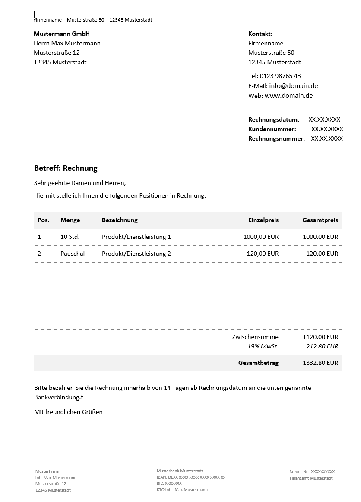

Так же важно отместить что в Бухгалтерском ПО и онлайн банках для бизнеса есть уже встроенный функционал по выставлению счетов, где достаточно заполнить недостающие поля.

Пример из **getsorted**:

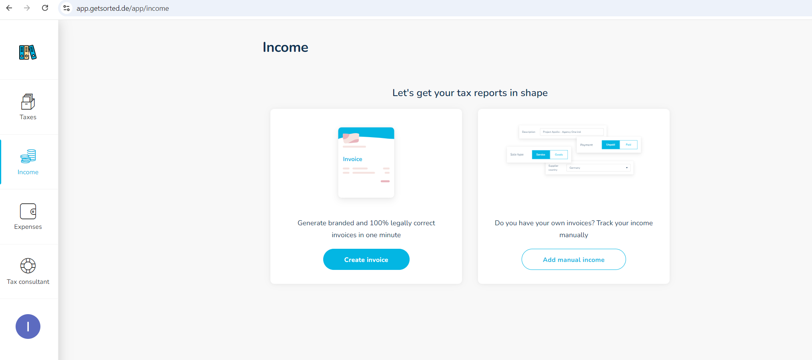

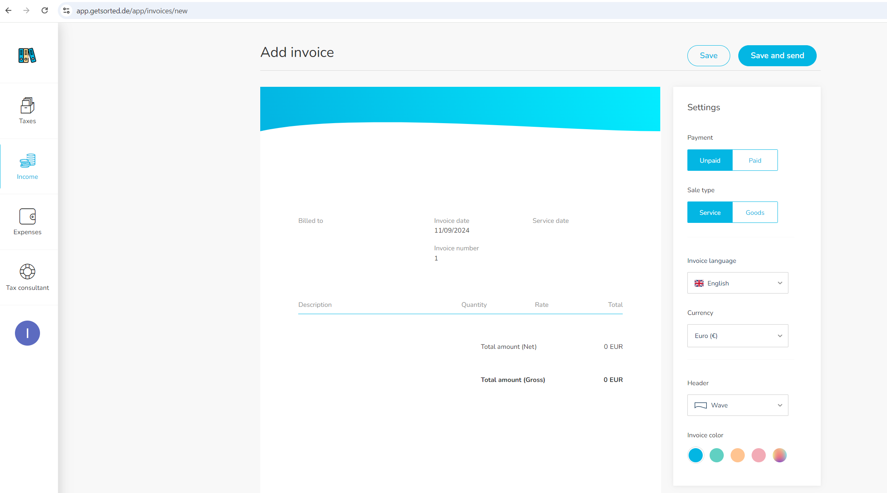

### Выставление счетов через сайт и онлайн платформы

#### 1. Что такое Stripe и как он работает?

Stripe — это онлайн-платежная платформа, которая позволяет бизнесам и фрилансерам легко принимать платежи через Интернет. Stripe поддерживает разнообразные методы оплаты, включая кредитные и дебетовые карты, банковские переводы, и локальные способы оплаты, такие как Sofort и Giropay, что особенно актуально для фрилансеров в Германии.

Основное преимущество Stripe — это простота и гибкость. С помощью Stripe вы можете легко выставлять счета, принимать платежи и управлять финансовыми операциями, не сталкиваясь со сложностями традиционных банковских систем.

#### 2. Преимущества использования Stripe для фрилансеров

- **Легкость интеграции:** Stripe предлагает простую интеграцию с веб-сайтами и платформами, такими как WordPress, WooCommerce, или даже с самописными сайтами через API. Если у вас нет сайта, вы все равно можете использовать Stripe для создания платежных ссылок или выставления счетов.

- **Поддержка различных платежных методов:** Stripe позволяет принимать платежи различными методами, включая:

  - Кредитные и дебетовые карты (Visa, MasterCard, American Express и др.)

  - Банковские переводы (SEPA)

  - Локальные способы оплаты, популярные в Германии (Sofort, Giropay)

  - Мобильные платежи (Apple Pay, Google Pay)

- **Высокий уровень безопасности:** Stripe соответствует стандартам PCI-DSS и использует передовые технологии шифрования для защиты данных платежей. Это дает вашим клиентам уверенность в безопасности их данных.

- **Автоматизация процесса платежей:** Stripe предоставляет возможность автоматической выставки счетов, отправки напоминаний о платежах и регулярных списаний, что особенно полезно для фрилансеров, работающих на основе подписки или долгосрочных контрактов.

- **Мультивалютность:** Stripe позволяет принимать платежи в более чем 135 валютах, что упрощает работу с клиентами из разных стран.

#### 3. Как настроить Stripe для приема платежей

##### Регистрация и настройка аккаунта

1.  **Создайте учетную запись на Stripe:** Перейдите на [stripe.com](https://stripe.com) и зарегистрируйтесь. Вам потребуется предоставить информацию о вашем бизнесе, такую как название, адрес, тип деятельности, и банковские реквизиты для вывода средств.

2.  **Пройдите процесс верификации:** Stripe требует подтверждения личности и банковской информации. Для этого вам нужно будет загрузить документы, удостоверяющие вашу личность (например, паспорт или ID-карту), а также указать действующий банковский счет.

##### Настройка платежных методов

3.  **Выбор методов оплаты:** В своем аккаунте Stripe перейдите в раздел "Payments" и выберите методы оплаты, которые вы хотите предложить своим клиентам. Для немецких клиентов полезно настроить SEPA Direct Debit, Sofort, Giropay и другие популярные в Германии способы оплаты.

4.  **Интеграция с вашим веб-сайтом:** Если у вас есть веб-сайт, Stripe предоставляет готовые решения для интеграции, такие как плагины для WordPress/WooCommerce или конструкторы сайтов. Если вы разрабатываете свой сайт самостоятельно, Stripe API предоставляет полный набор инструментов для создания кастомизированного процесса оплаты.

5.  **Создание платежных ссылок:** Если у вас нет веб-сайта, вы можете использовать функциональность "Payment Links" в Stripe. Эта функция позволяет создать уникальную ссылку для оплаты, которую можно отправить клиенту по электронной почте или через мессенджеры.

#### 4. Выставление счетов и получение платежей

1.  **Создайте счет:** В Stripe есть функция для создания и отправки счетов клиентам. Это особенно удобно для фрилансеров, поскольку вы можете настроить шаблон счета, указать описание услуг, количество, и применить налог (если применимо).

2.  **Получение платежа:** После отправки счета клиенту Stripe уведомит вас, когда платеж будет произведен. Средства зачисляются на ваш Stripe-счет, и затем вы можете вывести их на свой банковский счет.

3.  **Автоматизация:** Stripe позволяет настроить автоматическое списание, что идеально подходит для регулярных платежей, например, при работе на основе подписки или периодических платежей за услуги.

#### 5. Комиссии и вывод средств

- **Комиссии:** Stripe взимает комиссию за каждую транзакцию. Для европейских карт комиссия составляет 1,4% + €0,25 за транзакцию, для неевропейских карт — 2,9% + €0,25. Дополнительные комиссии могут взиматься за определенные виды платежей, такие как международные переводы.

- **Вывод средств:** Средства можно выводить на ваш банковский счет автоматически по расписанию (ежедневно, еженедельно, ежемесячно) или вручную. Обычно средства поступают на банковский счет в течение 2–7 дней.

#### 6. Особенности использования Stripe в Германии

- **Налогообложение:** В Германии фрилансеры обязаны указывать НДС (Mehrwertsteuer) в счетах клиентам, если ваш годовой доход превышает определенный порог. Stripe позволяет автоматически добавить налог на добавленную стоимость к вашим счетам. Не забудьте проконсультироваться с налоговым консультантом, чтобы правильно настроить систему в соответствии с требованиями немецкого налогового законодательства.

- **Локальные способы оплаты:** Stripe поддерживает популярные в Германии методы оплаты, такие как SEPA Direct Debit, Giropay, и Sofort, что делает оплату для ваших клиентов более удобной.

- **Бухгалтерский учет** Платформа предоставляет детализированные отчеты о транзакциях, что облегчает ведение бухгалтерии и подготовку к подаче налоговой декларации. Также доступна интеграция с популярными системами учета, такими как DATEV, Xero и QuickBooks.

- 

#### 7. Практические советы по работе со Stripe

- **Тестирование:** Перед тем как начать принимать платежи от клиентов, протестируйте процесс оплаты с помощью режима "Test Mode" в Stripe. Это позволит убедиться, что все настроено правильно и платежи будут проходить без сбоев.

- **Используйте отчеты:** Stripe предоставляет подробные отчеты о транзакциях, что упрощает управление финансами и подготовку к налоговой отчетности.

- **Поддержка клиентов:** Stripe предлагает обширную базу знаний и службу поддержки, к которой можно обратиться в случае возникновения вопросов или проблем.

#### Что такое Wise Business и как он работает?

**Wise Business** – это онлайн-сервис, который позволяет фрилансерам и компаниям отправлять и получать международные платежи, используя реальные обменные курсы. Это означает отсутствие скрытых комиссий и наценок на конвертацию валют. Платформа поддерживает мультивалютные счета, что делает ее идеальной для тех, кто работает с клиентами по всему миру.

Сервис особенно полезен для бизнеса, который регулярно выставляет счета в разных валютах. Wise Business упрощает процесс оплаты и делает его прозрачным как для отправителя, так и для получателя.

#### Преимущества использования Wise Business для фрилансеров

1.  **Низкие комиссии** Wise Business взимает фиксированную комиссию и процент от суммы перевода. Это гораздо дешевле, чем традиционные банковские переводы или использование кредитных карт.

2.  **Мультивалютные счета** Вы можете создать виртуальные счета в более чем 40 валютах, включая евро (EUR), доллары США (USD), британские фунты (GBP) и другие. Это удобно для работы с клиентами из разных стран, так как вы избегаете лишних затрат на конвертацию.

3.  **Выставление счетов** Платформа позволяет создавать профессиональные счета-фактуры с указанием стоимости услуг в нужной валюте. Клиенты могут легко оплатить их банковским переводом или картой.

4.  **Реальные курсы обмена** Wise использует среднерыночные курсы без наценок, что позволяет экономить на международных переводах.

5.  **Интеграция с бухгалтерскими системами** Сервис поддерживает интеграцию с такими инструментами, как Xero и QuickBooks, что упрощает ведение финансовой отчетности.

#### Как настроить Wise Business для приема платежей

1.  **Регистрация аккаунта** Зарегистрируйтесь на сайте Wise Business, предоставив информацию о вашем бизнесе. Процесс регистрации включает верификацию личности и документов компании.

2.  **Добавление валют** После регистрации вы можете открыть мультивалютный счет и настроить его под нужды вашего бизнеса.

3.  **Выставление счетов** Используйте платформу для создания счетов, указав описание услуги, стоимость и валюту. Счет можно отправить клиенту по электронной почте.

4.  **Подключение банковского счета** Для вывода средств привяжите банковский счет к платформе. Wise позволяет отправлять деньги в 80+ странах.

#### Комиссии и сроки вывода средств

Wise Business взимает:

- **Фиксированную комиссию**: например, €0,50 за перевод.

- **Процент от суммы перевода**: для большинства валют он варьируется от 0,35% до 1%.

Вывод средств на банковский счет обычно занимает от нескольких минут до 1-2 рабочих дней.

#### Особенности использования Wise Business в Германии

Работа с международными платежами в Германии имеет свои нюансы. **Wise Business** помогает эффективно решать вопросы, связанные с налоговым учетом, локальными требованиями и удобством для клиентов. Вот ключевые особенности:

##### 1. Поддержка SEPA-платежей

SEPA (Single Euro Payments Area) – это стандарт для банковских переводов в странах ЕС, который обеспечивает быстрые и удобные транзакции в евро. Wise полностью поддерживает SEPA-платежи, что дает следующие преимущества:

- **Быстрые переводы:** Средства обычно поступают в течение одного рабочего дня.

- **Низкие комиссии:** В отличие от традиционных банков, Wise взимает минимальные сборы за такие переводы.

- **Простота работы:** Нет необходимости указывать IBAN вручную – система автоматически проверяет и упрощает процесс отправки.

##### 2. Соответствие налоговым требованиям

В Германии все компании и фрилансеры обязаны учитывать налоговые аспекты при выставлении счетов. Wise предоставляет функции, которые упрощают соблюдение местного законодательства:

- **Включение НДС (Mehrwertsteuer):** В счете можно указать налоговую ставку (обычно 19% или 7%) и четко выделить сумму НДС. Это особенно важно для клиентов, зарегистрированных как юридические лица.

- **Экспорт отчетов:** Платформа позволяет экспортировать данные о транзакциях за любой период, что удобно для подачи налоговой декларации или подготовки к проверке.

- **Поддержка локальных налоговых кодов:** Возможность указания налогового номера (Steuernummer) или идентификатора НДС (USt-IdNr) непосредственно в шаблоне счета.

##### 3. Работа с клиентами в Германии

Для клиентов в Германии важно использовать популярные и привычные методы оплаты. Wise предлагает удобные решения:

- **SEPA Direct Debit:** Это автоматическое списание средств с банковского счета клиента, что удобно для подписочных моделей или регулярных платежей.

- **Локализация интерфейса:** Система доступна на немецком языке, а счета и уведомления можно отправлять на немецком, что повышает доверие клиентов.

- **Поддержка различных валют:** Несмотря на работу в Германии, многие фрилансеры работают с клиентами из других стран. Wise позволяет выставлять счета в EUR, GBP, USD и многих других валютах, что исключает дополнительные конверсии для клиента.

##### 4. Учет валютных переводов

Фрилансеры, работающие с международными клиентами, часто сталкиваются с необходимостью конвертации валют. В Германии важно:

- Указывать точную сумму в валюте клиента и её эквивалент в EUR, если это требуется для налоговой отчетности.

- Использовать среднерыночный курс для избежания дополнительных расходов. Wise автоматически отображает курс конвертации и комиссию, делая процесс прозрачным.

##### 5. Автоматизация бухгалтерии

Ведение бухгалтерии в Германии может быть сложным процессом, особенно для фрилансеров. Wise предлагает интеграцию с бухгалтерскими системами, такими как **DATEV**, **Xero**, и **QuickBooks**, что позволяет:

- Автоматически синхронизировать транзакции.

- Отмечать оплаченные счета и отслеживать задолженности.

- Готовить данные для налоговой декларации без необходимости ручного учета.

##### 6. Интеграция с немецкими банками

Для вывода средств или оплаты клиентам вы можете привязать к Wise банковский счет в немецком банке. Это гарантирует:

- **Быстрый вывод средств:** Средства обычно поступают в течение 1-2 рабочих дней.

- **Простую привязку IBAN:** Платформа поддерживает все немецкие банки, что упрощает процесс настройки.

##### 7. Практическая помощь для фрилансеров

Wise активно обновляет свою базу знаний и предоставляет специализированные инструкции для фрилансеров в Германии:

- Рекомендации по выставлению счетов.

- Советы по управлению мультивалютными счетами.

- Информация о налоговых правилах и отчетности в Германии.

##### 8. Отчетность для Finanzenamt

Wise позволяет подготовить всю необходимую информацию для подачи отчетности в налоговую службу Германии (Finanzamt):

- **Скачать все транзакции за год в удобном формате (CSV или PDF).**

- **Указать идентификаторы счетов для удобной сортировки доходов.**

- **Включить детали конверсии валют, если платежи получены в разных валютах.**

#### Практические советы по работе с Wise Business

- **Мультивалютные счета:** Используйте их для минимизации расходов на конвертацию валют.

- **Автоматизация бухгалтерии:** Интеграция с Xero и QuickBooks ускорит процесс учета финансов.

- **Тестирование системы:** Перед отправкой первого счета клиенту протестируйте функционал платформы.

### Годовая отчетность

Годовая отчетность является важной частью работы фрилансера в Германии. Подготовка отчетности включает в себя сбор всех финансовых данных за год, подачу налоговой декларации и соблюдение установленных законом сроков. Для фрилансеров, использующих **EÜR (Einnahmenüberschussrechnung)** — упрощенную систему учета доходов и расходов, правильная подготовка и подача отчетности помогает избежать проблем с налоговой службой.

#### 1.1. Подготовка годового отчета

Подготовка годового отчета начинается с систематизации всех финансовых документов и их корректного учета. Важно собрать и обработать:

- **Доходы**: Все полученные доходы за год, включая счета, которые вы выставили клиентам, и полученные платежи.

- **Расходы**: Включают аренду офиса, расходы на оборудование, поездки, профессиональные обучения, а также любые другие расходы, связанные с ведением бизнеса.

- **Амортизация активов**: Если вы приобрели оборудование или транспортные средства, их стоимость может списываться в течение нескольких лет.

Для подготовки годового отчета можно использовать различные платформы для ведения бухгалтерии, такие как **LexOffice**, **SevDesk** или **Getsorted**. Эти программы упрощают сбор данных и помогают организовать бухгалтерию в удобном формате. Такие сервисы автоматически формируют отчеты, синхронизируют данные с банковскими счетами и подготавливают документы для налоговой декларации.

#### 1.2. Заполнение налоговой декларации

Заполнение налоговой декларации — важный этап, который необходимо завершить до конца установленного срока. Основные формы для подачи:

- **Anlage EÜR** – для учета доходов и расходов;

- **Einkommensteuererklärung** – декларация по подоходному налогу;

- **Umsatzsteuererklärung** – декларация по НДС, если вы зарегистрированы как плательщик НДС;

- **Gewerbesteuererklärung** – декларация по налогу на предпринимательство (если применимо).

### Типичные ошибки (быстрый переход)

См. блок [10 типичных ошибок новичка](#10-типичных-ошибок-новичка) в конце документа.

#### Программы для автоматизации заполнения отчетности

- **ELSTER**: Официальный портал немецкой налоговой службы для подачи деклараций онлайн.

- **LexOffice**: Облачная платформа для ведения бухгалтерии и подготовки налоговой отчетности, которая помогает автоматизировать процессы.

- **SevDesk**: Предоставляет простые инструменты для ведения бухгалтерии, создания счетов и подачи налоговых деклараций.

- **Getsorted**: Еще один удобный сервис для фрилансеров, позволяющий легко управлять финансами и подготовкой отчетности.

Эти платформы позволяют легко интегрировать данные о доходах и расходах, автоматически формируют необходимые документы и могут помочь избежать ошибок в заполнении налоговой декларации.

#### 1.3. Сроки подачи отчетности

Фрилансерам важно соблюдать сроки подачи отчетности, чтобы избежать штрафов. Основные сроки следующие:

- **До 31 июля следующего года**, если вы подаете декларацию самостоятельно.

- **До 28 февраля следующего года**, если вы работаете с налоговым консультантом.

Пример: если вы подаете налоговую отчетность за 2023 год, то крайний срок подачи при самостоятельной подаче — 31 июля 2024 года, а если вы пользуетесь услугами налогового консультанта, срок продлевается до 28 февраля 2025 года​(

Соблюдение этих сроков позволяет избежать штрафов и проблем с налоговой службой, а использование специализированных платформ для ведения бухгалтерии упрощает процесс подготовки и подачи отчетности.

## 4. ПО для Бухгалтерии

Фрилансерам в Германии необходимо эффективно управлять своими финансовыми потоками и налогами. Бухгалтерские программы позволяют автоматизировать процессы, что значительно упрощает работу. Ниже рассмотрены семь популярных решений, которые идеально подходят для фрилансеров.

#### 1.Lexoffice

Lexoffice — одно из наиболее популярных облачных решений для автоматизации бухгалтерии. Оно подходит для фрилансеров и малого бизнеса, предоставляя возможность интеграции с банками и автоматизации налогообложения. Поддерживает создание годовой отчётности EüR и интеграцию с системами **ELSTER** и **DATEV**.

- Поддерживаемые банки: Qonto, N26, Commerzbank, ING, Finom,Kontist..

- **Стоимость**: от €6.90 до €29.90 в месяц.

Плюсы:

- Простота использования.

- Интеграция с банковскими системами.

- Автоматический расчёт налогов и учёт НДС.

#### 2. SevDesk

SevDesk — облачная бухгалтерская программа, которая помогает автоматизировать ведение учёта, создание счетов и налоговую отчётность. Она также интегрируется с множеством банков и системой **DATEV**.

- Поддерживаемые банки: Sparkasse, Deutsche Bank, Commerzbank, Volksbank, N26, Finom,Kontist.

- **Стоимость**: от €8.90 до €42.90 в месяц.

Плюсы:

- Мобильное приложение.

- Интеграция с 3000+ банками.

- Возможность сканирования квитанций.

#### 3. Lexware

Lexware — это десктопное решение, подходящее для фрилансеров и малого бизнеса. Оно поддерживает двойную бухгалтерию и расчёт заработных плат, что делает его идеальным для тех, кто работает с большим количеством транзакций.

- Поддерживаемые банки: Volksbank, Postbank, Sparkasse, Finom,Kontist.

- **Стоимость**: от €19.90 до €71.80 в месяц.

Плюсы:

- Поддержка двойной бухгалтерии.

- Расчёт зарплат.

#### 4. FastBill

FastBill предлагает автоматизацию учёта для малого бизнеса и фрилансеров, а также интеграцию с банковскими системами и сервисами. С помощью FastBill можно легко вести учёт квитанций, создавать счета и управлять налогами.

- Поддерживаемые банки: Deutsche Bank, N26, Postbank, Sparkasse.

- **Стоимость**: от €9 до €53 в месяц.

Плюсы:

- Автоматизация финансовых процессов.

- Простота использования.

#### 5. Sage 50

Sage 50 — это комплексное решение для бухгалтерии, которое также поддерживает интеграцию с платёжными системами и онлайн-магазинами. Это делает его подходящим как для фрилансеров, так и для малого бизнеса.

- Поддерживаемые банки: Commerzbank, PayPal, Stripe.

- **Стоимость**: от €30 до €40 в месяц.

Плюсы:

- Поддержка онлайн-магазинов.

- Интеграция с платёжными системами.

#### 6. BuchhaltungsButler

BuchhaltungsButler предлагает автоматизацию учёта и интеграцию с банками и системами налоговой отчётности, такими как **DATEV** и **ELSTER**. Программа подходит для автоматизации рутинных бухгалтерских задач.

- Поддерживаемые банки: DATEV, Sparkasse, Deutsche Bank, Volksbank.

- **Стоимость**: от €34.95 до €79.95 в месяц.

Плюсы:

- Поддержка автоматического сканирования и учёта документов.

#### 7. WISO Mein Büro

WISO Mein Büro предлагает как десктопную, так и облачную версии для управления бухгалтерией. Она поддерживает интеграцию с банковскими системами и платёжными сервисами.

- Поддерживаемые банки: Commerzbank, Sparkasse, Postbank, Finom,Kontist..

- **Стоимость**: от €14.90 до €139.90 в месяц.

Плюсы:

- Обширные возможности для отчётности.

- Интеграция с ELSTER.

#### Getsorted

**Getsorted** — это ещё одно облачное решение, разработанное специально для фрилансеров и малого бизнеса в Германии. Оно помогает автоматизировать ведение бухгалтерии и налоговых отчётов, облегчая процесс подачи годовой отчётности EüR через интеграцию с ELSTER.

Особенности:

- Полная автоматизация налогов и подачи деклараций.

- Интеграция с банковскими системами и автоматическое получение транзакций.

- Поддержка EüR и USt (налог на добавленную стоимость).

Поддерживаемые банки: N26, Deutsche Bank, Commerzbank, Sparkasse, Finom,Kontist..

**Стоимость**: от €8 в месяц.

#### Accountable

Accountable — облачное приложение для бухгалтерии, специально разработанное для фрилансеров и самозанятых в Германии. Оно помогает автоматизировать учёт доходов и расходов, создавать счета, подавать налоговые декларации и интегрируется с немецкими налоговыми стандартами.

- **Поддерживаемые банки:** N26, Commerzbank, Deutsche Bank, Sparkasse и другие.

- **Стоимость:** Бесплатный базовый план или от €7.50 до €24.50 в месяц за премиум-функции.

**Плюсы:**

- Удобное мобильное приложение.

- Простая интеграция с банковскими счетами.

- Автоматическое заполнение налоговых деклараций.

- Напоминания о налоговых сроках.

Сравнительная таблица Бухгалтерского ПО

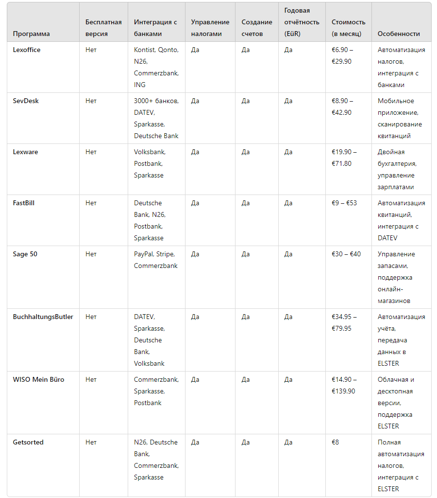

## 5. Банки

### Обзор популярных онлайн банков для фрилансеров в Германии

Выбор подходящего онлайн-банка для фрилансера — важный шаг для эффективного управления финансами. В статье рассмотрены основные банки, которые предлагают гибкие тарифы, удобный интернет-банкинг, интеграцию с бухгалтерскими программами и другие полезные функции. Мы также включили подробную таблицу для сравнения ключевых параметров.

#### 1. Kontist

Kontist — это банк, специально разработанный для фрилансеров. Он предлагает автоматический расчёт налогов и интеграцию с популярными бухгалтерскими программами, что значительно упрощает финансовую отчётность и управление налогами.

Функции:

- Автоматический расчёт налогов и НДС.

- Бесплатная виртуальная Visa-карта, физическая карта за €29/год.

- Интеграция с **Lexoffice**, **Debitoor**, **Fastbill** — можно легко управлять расходами и доходами.

Особенности:

- Нет кэшбэка.

- Видео-идентификация.

- Google Pay/Apple Pay для мобильных платежей.

#### 2. N26 Business

N26 — один из крупнейших мобильных банков в Европе, предлагающий выгодные условия для международных переводов и встроенный кэшбэк на покупки. Поддерживает интеграцию с внешними бухгалтерскими сервисами.

Функции:

- Бесплатный базовый тариф с неограниченными SEPA-транзакциями.

- Подключение к **Accountable** для автоматизации бухгалтерии.

- Кэшбэк от 0,1% до 0,5%.

Особенности:

- Поддержка мобильных платежей через Google/Apple Pay.

- Видео-идентификация для открытия счета.

- Подключение к внешним сервисам через API.

#### 3. Qonto

Qonto предоставляет различные тарифы и расширенные функции для малого бизнеса, включая возможность подключения нескольких пользователей. Это идеальный выбор для фрилансеров, которые хотят иметь интеграцию с бухгалтерией и управлять своими счетами.

Функции:

- Интеграция с **Lexoffice**, **Datev**, **SevDesk** для автоматизации финансового учёта.

- Возможность использования нескольких карт и субсчетов.

Особенности:

- Google Pay/Apple Pay для мобильных платежей.

- Видео-идентификация.

- Возможность API-интеграции для автоматизации процессов.

#### 4. Finom

Finom предлагает гибкую систему выставления счетов и интеграцию с бухгалтерскими системами, что делает его привлекательным для фрилансеров, работающих с многочисленными клиентами.

Функции:

- Инструменты для управления квитанциями и выставления счетов.

- Интеграция с **Lexoffice** и **SevDesk**.

Особенности:

- Кэшбэк до 3% на премиум-тарифах.

- Мобильные платежи через Google Pay и Apple Pay.

- Видео-идентификация и поддержка API для автоматизации.

#### 5. Fyrst

Fyrst — это немецкий цифровой банк, поддерживающий бухгалтерские программы и предлагающий бесплатные снятия наличных в банкоматах Германии. Его главное преимущество — удобство и интеграция с финансовыми системами, такими как **Lexoffice** и **SevDesk**.

Функции:

- Интеграция с Lexoffice, SevDesk, Sage.

- Бесплатная VISA-карта для бизнеса.

Особенности:

- Только немецкий язык.

- Поддержка Google/Apple Pay.

- Бесплатные снятия наличных в банкоматах по всей Германии.

#### 6. Vivid

Vivid — это ещё один интересный выбор для фрилансеров. Он предлагает высокие кэшбэки и бесплатное обслуживание для базовых пользователей. Подходит для тех, кто хочет использовать множество дополнительных карт и субсчетов.

Функции:

- До 25% кэшбэк на избранные категории покупок.

- Бесплатные снятия наличных до €200 в месяц.

Особенности:

- Google/Apple Pay.

- Видео-идентификация.

- API для интеграции с внешними сервисами.

Дата создания таблицы 11.09.2024

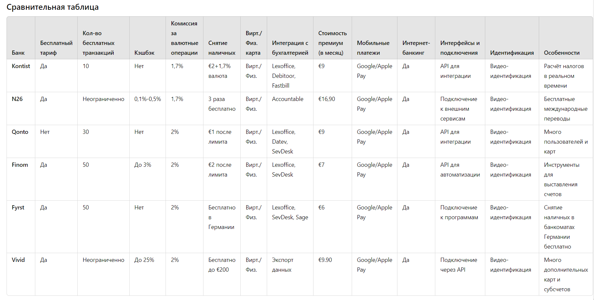

Самую актуальную информацию по предложениям банков для Geschäftskonto можно найти поссылкам ниже:

<https://www.finanzfluss.de/vergleich/geschaeftskonto/>

<https://www.fuer-gruender.de/kapital/fremdkapital/hausbank/geschaeftskonto/vergleich/>

## 6. Страховки

Фрилансеры в Германии, как и другие самозанятые лица, должны учитывать несколько важных видов страхования, чтобы защитить себя и свой бизнес от возможных рисков. Страховки могут быть как обязательными, так и рекомендованными, в зависимости от характера деятельности.

Пороги и максимальные базы взносов (BBG/JAEG) ежегодно индексируются, поэтому цифры ниже ориентировочные по диапазонам на 2025 год. За актуальными значениями сверяйтесь с TK/BMG/DRV.

**Кратко:**
- Медстраховка обязательна: GKV ~14,6% + доп. взнос, PKV — фиксированно.
- Рассмотрите Haftpflicht/BU как базовые добровольные.
- Узнайте, требуются ли взносы в DRV/KSK по профессии; суммы зависят от BBG/JAEG, пересматриваются ежегодно.

#### 1. Медицинская и страховка на случай инвалидности (Krankenversicherung + Pflegeversicherung)

В Германии каждый фрилансер обязан иметь медицинскую страховку. У вас есть выбор между государственной (gesetzliche Krankenversicherung) и частной (private Krankenversicherung) страховкой. Для молодых и здоровых фрилансеров часто выгоднее выбирать частную страховку, так как её взносы не зависят от дохода, в отличие от государственной, где взносы составляют 14,6% (плюс дополнительный взнос 1.0 - 2.0% в среднем) )от дохода плюс около 3-4% на <u>уходовую страховку</u> (Pflegeversicherung). Однако в государственной системе можно бесплатно застраховать членов семьи, что не доступно в частных планах.

Стоимость: **250 – 1 000 € в месяц**, в зависимости от выбранного варианта.

#### 2. Страхование от несчастных случаев (Unfallversicherung)

Эта страховка обязательна для фрилансеров, если они являются членами **Berufsgenossenschaft** — профессиональной ассоциации. В остальных случаях страхование добровольное, но крайне рекомендуется. Страховка покрывает расходы на реабилитацию и компенсацию потерь в результате несчастных случаев на работе.

Стоимость: 5 – 20 € в месяц.

#### 3. Пенсионное страхование (Altersvorsorge)

Пенсионное страхование обязательно только для некоторых профессий, таких как журналисты, врачи и педагоги. Для остальных фрилансеров участие в государственной пенсионной системе является добровольным. Важно как можно раньше начать откладывать на пенсию, так как государство не обеспечивает социальных гарантий для фрилансеров.

Стоимость: ориентировочно **900–1 000 € в месяц** при полной ставке на 2025; минимальный добровольный взнос может быть около 100 € в зависимости от выбранного класса. Вы сами решаете, какой размер взноса осуществлять.

#### Künstlersozialkasse (KSK) для творческих профессий 

Для фрилансеров в художественной и публицистической сферах (писатели, журналисты, дизайнеры, музыканты и т.д.) существует Künstlersozialkasse (KSK). KSK позволяет платить только половину взносов на медицинское, по уходу и пенсионное страхование; вторую половину покрывает KSK (финансируется за счет отчислений компаний-заказчиков и гос. субсидий). Основные критерии: деятельность преимущественно художественная/публицистическая, самозанятость, доход выше минимального порога. Процесс подачи заявления в KSK может быть длительным. Компании, заказывающие услуги у таких фрилансеров, обязаны уплачивать Künstlersozialabgabe.

#### 4. Страхование от потери трудоспособности (Berufsunfähigkeitsversicherung)

Это одна из важнейших страховок для фрилансеров, так как она защищает от финансовых потерь в случае, если вы больше не сможете работать из-за болезни или несчастного случая. Страховка покрывает пропущенные доходы и помогает избежать серьезных финансовых трудностей.

Стоимость: 60 – 200 € в месяц.

#### 5. Профессиональная ответственность (Berufshaftpflichtversicherung)

Эта страховка необходима для фрилансеров, особенно для тех, кто занимается консалтинговыми или проектными работами. Она защищает от рисков, связанных с ошибками в работе, которые могут привести к финансовым потерям клиентов. Например, если вы дали неверную консультацию или нарушили авторские права, эта страховка покроет судебные расходы и возможные штрафы.

Стоимость: 10 – 50 € в месяц.

#### 6. Гражданская ответственность бизнеса (Betriebshaftpflichtversicherung)

Это страхование защищает вас в случае, если кто-то получил ущерб (физический или материальный) на вашем рабочем месте или в результате вашей деятельности. Например, если клиент поскользнётся у вас в офисе или вы случайно повредите его имущество, страховка покроет расходы на лечение и ремонт.

Стоимость: 8 – 25 € в месяц.

#### 7. Юридическая защита (Gewerblicher Rechtsschutz)

Эта страховка важна, если вам необходимо защищать свои интересы в суде, особенно в случае споров с клиентами, которые отказываются платить по счетам. Страховка покрывает юридические расходы, включая оплату адвокатов и судебные издержки.

Стоимость: 25 – 50 € в месяц.

#### 8. Страхование имущества бизнеса (Geschäftsinhaltsversicherung)

Эта страховка защищает имущество вашего бизнеса, например, офисное оборудование или технику, от кражи, пожара или других повреждений. Она особенно актуальна для тех фрилансеров, у которых есть собственные офисные помещения.

Стоимость: 5 – 10 € в месяц.

Таблица страховок:

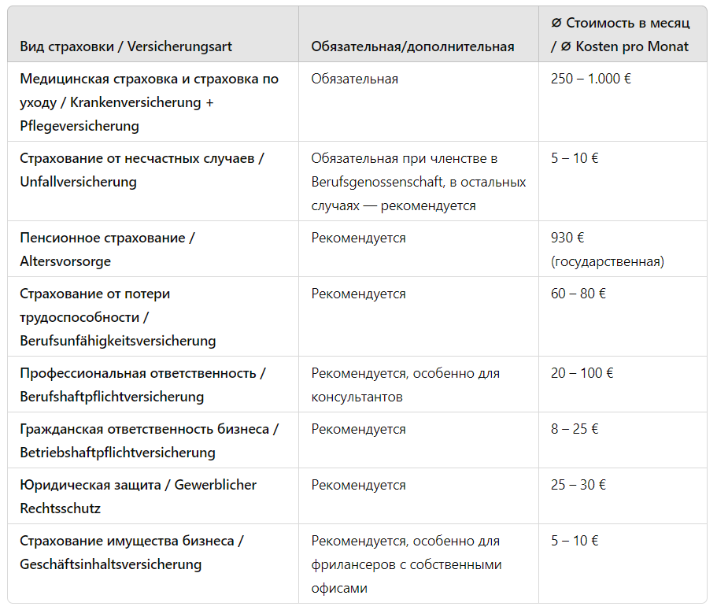

#### 9. Заключение

Для фрилансеров важно правильно выбрать страховые программы, которые помогут защитить их бизнес и обеспечить финансовую стабильность. Некоторые страховки являются обязательными, такие как медицинская и уходовая страховка, в то время как другие (например, профессиональная ответственность) являются крайне рекомендованными для обеспечения защиты от непредвиденных рисков.

## 7. Работа

### Расчет своей стоимости на рынке труда

Правильный расчет почасовой ставки — это ключевой фактор успешного ведения бизнеса. Важно учитывать все свои расходы, доходы и факторы, которые могут повлиять на вашу работу и заработок. В этой главе мы рассмотрим, как рассчитать вашу ставку, используя предоставленные данные и таблицу-калькулятор. Также добавим информацию о средних ставках по отраслям и учете различных расходов, таких как налоги, праздники, больничные и другие непредвиденные затраты.

#### Шаг 1: Определите желаемый доход

Первый шаг — определить, сколько вы хотите зарабатывать ежемесячно или ежегодно. В нашем примере фрилансер установил:

- Ежемесячный доход: 5750 евро

- Годовой доход: 69000 евро

Это ваша отправная точка. Однако важно помнить, что это не та сумма, которую вы получите «на руки» — в эту сумму включены все ваши будущие налоги, расходы на социальные взносы и другие обязательные платежи.

#### Шаг 2: Учтите количество рабочих часов

Далее следует рассчитать, сколько часов в месяц вы планируете работать. Это можно сделать, определив количество рабочих дней в году. В нашем примере:

- Рабочие дни в году: 261 день

- **Свободные дни:** 45 дней (включая праздники, отпуск, дни на обучение и болезни)

Теперь важно учесть, что не все время будет оплачиваться клиентами. В среднем фрилансеры теряют около 30% времени на непродуктивные задачи, такие как поиск клиентов, бухгалтерия, обучение и другие административные задачи. Поэтому:

- Не оплачиваемое время: 30%

#### Шаг 3: Рассчитайте количество оплачиваемых часов

Чтобы получить количество оплачиваемых часов в месяц, необходимо учесть вышеупомянутые параметры. В нашем примере:

- Общее количество рабочих часов в год: 261 день × 8 часов = 2088 часов

- Не оплачиваемое время (30%): 2088 × 30% = 626,4 часов

- **Оплачиваемое время в год:** 2088 - 626,4 = 1461,6 часов в год или 121,8 часов в месяц.

Таким образом, у нас есть ориентир: вы будете работать 121,8 оплачиваемых часов в месяц.

#### Шаг 4: Рассчитайте почасовую ставку

Теперь можно рассчитать минимальную почасовую ставку. Для этого необходимо разделить ваш желаемый доход на количество оплачиваемых часов:

- Ежемесячный доход: 5750 евро

- Оплачиваемые часы в месяц: 121,8 часов

Почасовая ставка = 5750 / 121,8 = **47,20 евро**

Это минимальная ставка, которую вам нужно выставлять за каждый час работы, чтобы достичь вашего целевого дохода. Однако, на практике эту ставку можно увеличить, учитывая следующие факторы:

1.  **Непредвиденные расходы:** Бывают случаи, когда требуется больше времени на проект или возникают непредвиденные затраты, такие как повышение цен на инструменты или услуги.

2.  **Конкуренция на рынке:** Если вы работаете в высококонкурентной нише, вашей ставке может потребоваться корректировка в зависимости от среднего уровня ставок.

#### Шаг 5: Учтите социальные взносы и налоги

В Германии фрилансеры обязаны самостоятельно выплачивать взносы в социальные фонды, такие как медицинская страховка и пенсионные отчисления. В нашем примере используются следующие ставки:

- Медицинское страхование (включая страхование на случай нетрудоспособности): 14,6%

- Пенсионные отчисления: 18,6%

Эти проценты необходимо учесть в вашем общем доходе. Например, если ваши расходы на социальное страхование составляют около 20% от дохода, тогда для покрытия этих затрат нужно добавить 20% к вашей минимальной ставке:

- 47,20 евро × 1,20 = **56,64 евро**

Это новая ставка, включающая ваши расходы на социальные взносы.

#### Шаг 6: Учтите основные расходы фрилансера

Чтобы не оказаться в убытке, важно учесть все ваши расходы при расчете ставки. Вот основные категории, которые стоит включить:

1.  Офисные и рабочие расходы:

    - Аренда рабочего места или офиса (если вы работаете не из дома)

    - Покупка оборудования (компьютеры, программное обеспечение)

    - Расходы на интернет, телефон, почтовые услуги

    - Обслуживание техники и программ

2.  Реклама и маркетинг:

    - Создание и поддержка сайта

    - Продвижение в социальных сетях

    - Оплата услуг рекламных платформ

3.  Транспортные расходы:

    - Командировки и поездки на встречи с клиентами

    - Амортизация и обслуживание автомобиля (если используется для работы)

4.  Обучение и развитие:

    - Курсы повышения квалификации

    - Покупка литературы, участие в конференциях

5.  Административные расходы:

    - Бухгалтерские услуги

    - Оплата налоговых консультантов

    - Затраты на ведение отчетности и бухгалтерии

6.  Страхование:

    - Медицинское страхование (обязательно)

    - Страхование от несчастных случаев

    - Страхование ответственности перед третьими лицами

7.  Резервные фонды:

    - Непредвиденные расходы (ремонт оборудования, юридические услуги)

    - Резервный фонд на случай отсутствия заказов или болезни

#### Шаг 7: Учет выходных, больничных и праздников

При расчете ставки важно учитывать время, когда вы не работаете. Фрилансеры, в отличие от сотрудников, не получают оплаты за больничные или выходные. Включите эти периоды в свои расчеты:

1.  **Праздничные дни**: В Германии количество праздничных дней может варьироваться в зависимости от федеральной земли. Обычно это около **13 дней в год**.

2.  **Отпуск**: Несмотря на то, что фрилансеры часто не могут позволить себе много выходных, рекомендуется включать минимум **25 дней отпуска в год** в расчеты.

3.  **Больничные**: Статистически в Германии на болезни уходит около **10-15 дней в год**.

4.  **Время на обучение**: В среднем фрилансеры тратят **5-10 дней в год** на повышение квалификации.

#### Пример итогового расчета

Предположим, что фрилансер хочет получать 69000 евро в год и работает 1462 часа в год с учетом всех простоев. Он рассчитывает минимальную ставку, добавляя расходы на социальное обеспечение:

1.  Базовая почасовая ставка: 47,20 евро

2.  Ставка с учетом социальных взносов: 56,64 евро

Таким образом, для достижения желаемого дохода фрилансеру следует ориентироваться на почасовую ставку **не менее 57 евро**.

#### Шаг 8: Учитывайте рыночные ставки по отраслям

Очень важно понимать, что размер почасовой ставки зависит также от вашей специализации и отрасли. В Германии существует большой диапазон почасовых ставок, который варьируется в зависимости от специфики работы. Согласно данным из **Freelancermap**, вот примеры средних ставок в различных отраслях:

- SAP консультанты: 99 евро в час

- Консалтинг и менеджмент: 93 евро в час

- **IT разработка:** 91 евро в час

- Инженерные услуги: 87 евро в час

- **Медиа:** 69 евро в час

Эти цифры показывают средний уровень по индустрии, и ваш почасовой тариф должен быть сопоставим с конкурентами в вашей сфере. Например, если вы являетесь IT-специалистом, работающим над разработкой ПО, то ставка в диапазоне от 90 до 100 евро будет оправданной.

#### 9. Заключение

Почасовая ставка фрилансера в Германии зависит от множества факторов, таких как рабочие часы, непродуктивное время, налоги и социальные взносы, а также ситуация на рынке. Используя калькулятор и предоставленные данные, вы можете точно рассчитать свою ставку, чтобы покрывать все расходы и зарабатывать желаемую сумму. Не забудьте регулярно пересматривать свои расчеты, учитывая изменения в расходах и требования рынка.

Этот расчет поможет вам эффективно управлять своими финансами и быть уверенным, что вы получаете справедливую оплату за свои услуги, оставаясь конкурентоспособным в своей отрасли.

### Где и как искать работу ( Kundenakquise für Freelancer)?

Одной из главных задач для фрилансера, особенно на начальном этапе, является поиск клиентов. Умение эффективно привлекать заказчиков определяет успех и стабильность работы. Важно понимать, что клиентская база должна постоянно расширяться, и зависеть только от одного источника проектов — рискованно. В этой статье мы разберем стратегии, которые помогут фрилансерам привлекать новых клиентов, а также расскажем о лучших платформах для поиска проектов.

#### Что такое привлечение клиентов?

Привлечение клиентов или "Kundenakquise" — это процесс поиска и завоевания новых клиентов. Он включает в себя разные действия, направленные на выявление потенциальных заказчиков, их вовлечение и заключение контрактов. Однако успех в клиентской аквизиции основывается на понимании нужд клиента и способности предложить решение, соответствующее его проблемам и ожиданиям.

#### Формы привлечения клиентов

Существует несколько основных форм "Kundenakquise", каждая из которых имеет свои преимущества:

1.  **Холодные контакты ("Kaltakquise")** — это прямая связь с потенциальными клиентами без предварительных взаимоотношений. Обычно такие контакты происходят через телефонные звонки, электронные письма или социальные сети. Холодная аквизиция требует настойчивости и подготовки, так как далеко не все компании готовы к неожиданным предложениям.

2.  **Теплые контакты ("Warmakquise")** — здесь клиент уже знает о фрилансере или его услугах. Это может быть контакт через рекомендации, бывших клиентов или предыдущие деловые связи. Такой способ проще и эффективнее, так как между сторонами уже существует доверие.

3.  **Рекомендательный маркетинг ("Empfehlungsmarketing")** — это получение новых клиентов через рекомендации довольных заказчиков. Этот метод эффективен, если у вас уже есть клиенты, которые могут порекомендовать ваши услуги коллегам или партнерам.

#### Активные и пассивные методы привлечения клиентов

При поиске клиентов можно использовать два основных подхода: активный и пассивный.

Активные методы:

- Участие в конференциях и отраслевых мероприятиях.

- Прямое обращение к компаниям через электронную почту или телефон.

- Использование фриланс-платформ для поиска проектов.

- Создание личного бренда через социальные сети и публикации.

Пассивные методы:

- SEO-оптимизация собственного сайта или портфолио.

- Ведение блога или публикация статей, которые могут привлечь внимание потенциальных клиентов.

- Профиль на платформах с возможностью поиска фрилансеров.

- Размещение положительных отзывов и кейсов для привлечения новых заказчиков.

#### Шаги к успешной клиентской аквизиции

##### 1. Определите свою целевую аудиторию

Чтобы найти клиентов, нужно знать, кто они. Проведите анализ потенциальных клиентов: их возраст, профессия, интересы, отрасль. Создайте "buyer personas" — это фальшивые образы типичных клиентов, которые помогут адаптировать ваше предложение.

##### 2. Найдите свою нишу и уникальное торговое предложение (USP)

Чем вы отличаетесь от конкурентов? Важно выделить ваши уникальные сильные стороны: это может быть специализированный опыт, уникальные навыки или особые методы работы. Определение вашего "USP" помогает не только выделиться среди конкурентов, но и правильно выбрать каналы для привлечения клиентов.

##### 3. Выберите правильные каналы для привлечения клиентов

Где ваша аудитория проводит время? Если ваши клиенты — молодые стартапы, они, скорее всего, находятся в социальных сетях. Если вы работаете с крупными компаниями, больше внимания стоит уделить бизнес-платформам вроде LinkedIn или Xing.

##### 4. Постоянно ведите поиск

Не ждите спада в проектах, чтобы начинать искать новых клиентов. Это должно быть постоянной частью вашей работы, даже когда у вас есть текущие проекты.

##### 5. Выстроите долгосрочные отношения

После завершения проекта поддерживайте связь с клиентом. Регулярные письма, поздравления с праздниками или просто внимание к новостям компании могут сделать вас "фрилансером по умолчанию" для следующих задач.

#### ТОП-5 платформ для поиска клиентов в Германии

В Германии существует множество специализированных платформ для поиска проектов. Вот пять самых популярных среди фрилансеров:

1.  **Freelancermap.de**  
    Немецкая платформа, которая специализируется на проектах в области IT, разработки программного обеспечения и цифрового маркетинга. Она предоставляет доступ к большому числу вакансий для фрилансеров.

2.  **Xing Projekte**  
    Xing — это немецкий аналог LinkedIn, и он предлагает специальную секцию для поиска проектов и фрилансеров. Это отличная площадка для тех, кто ищет клиентов среди немецкоговорящих компаний.

3.  **Gulp.de**  
    Gulp — это одна из крупнейших платформ для поиска IT-фрилансеров в Германии. Она предлагает проекты как для краткосрочной, так и для долгосрочной работы в таких областях, как разработка программного обеспечения и IT-консалтинг.

4.  **Twago.de**  
    Twago ориентирована на фрилансеров в различных областях, от маркетинга до разработки программного обеспечения. Платформа позволяет напрямую связываться с клиентами и подавать заявки на интересующие проекты.

5.  **DasAuge.de**  
    Платформа DasAuge популярна среди дизайнеров, графиков и специалистов по рекламе. Она предоставляет доступ к креативным проектам для фрилансеров, работающих в Германии.

#### ТОП-5 международных платформ для поиска клиентов

На мировом уровне также существуют платформы, которые позволяют фрилансерам находить работу в разных странах:

1.  **Upwork**  
    Одна из крупнейших фриланс-платформ в мире, предлагающая проекты в самых разных областях, от IT до перевода и дизайна. Upwork предоставляет фрилансерам возможность находить как краткосрочные, так и долгосрочные проекты.

2.  **Freelancer.com**  
    Международная платформа, на которой можно найти проекты по разработке, дизайну, маркетингу и другим направлениям. Freelancer.com популярен благодаря своему огромному количеству пользователей и проектов.

3.  **Fiverr**  
    Fiverr предлагает фрилансерам возможность продавать свои услуги, начиная с небольших заданий за 5 долларов. Это отличная платформа для тех, кто хочет быстро найти краткосрочные задания и построить портфолио.

4.  **Toptal**  
    Платформа для опытных фрилансеров в IT и разработке программного обеспечения. Toptal сотрудничает с ведущими компаниями мира, и процесс отбора на платформу более строгий, чем на других сайтах.

5.  **PeoplePerHour**  
    Платформа, которая объединяет фрилансеров и клиентов по всему миру. Проекты на PeoplePerHour охватывают широкий спектр услуг, от веб-дизайна до цифрового маркетинга.

#### 9. Заключение

Привлечение клиентов для фрилансера — это непрерывный процесс, требующий стратегии, упорства и использования правильных инструментов. Важно уметь комбинировать активные и пассивные методы, регулярно искать проекты и поддерживать связь с клиентами. Использование специализированных платформ в сочетании с хорошо продуманным личным брендом и сетевым взаимодействием поможет фрилансерам успешно развивать свой бизнес и находить новых заказчиков как в Германии, так и по всему миру.

### Потеря работы и государственная поддержка

В Германии существуют программы поддержки для тех, кто хочет начать фриланс, находясь на пособии по безработице, а также для тех, кто уже работает фрилансером, но потерял клиентов и оказался в сложной ситуации.

#### 1. **Старт фриланса с пособия по безработице (Arbeitslosengeld I)**

Если вы находитесь на пособии по безработице (ALG I) и планируете стать фрилансером, вы можете претендовать на **Gründungszuschuss** (субсидию на открытие бизнеса). Эта субсидия состоит из двух этапов:

- **Этап 1:** В течение первых 6 месяцев вы получаете сумму, равную вашему последнему пособию по безработице, плюс дополнительно €300 в месяц на социальное страхование.

- **Этап 2:** Если вы продемонстрируете успешное развитие бизнеса, можете получать еще €300 в месяц в течение следующих 9 месяцев​, [<u>IHK_DE</u>](https://www.ihk.de/rhein-neckar/gruendung/finanzierung/foerderprogramme/gruendungszuschuss-947662)

**Требования для получения Gründungszuschuss**:

- **Остаток права на ALG I:** Минимум 150 дней остаточного права на получение пособия.

- **Бизнес-план:** Необходимо представить подробный бизнес-план, включающий финансовые прогнозы и описание концепции, который должен быть утвержден экспертным органом, например, IHK (Торгово-промышленная палата)​

- **Подтверждение жизнеспособности:** Вы должны убедить агентство по труду в своей компетентности и жизнеспособности бизнес-идеи.

**Дополнительные расходы**:

- **Сбор IHK:** Например, в IHK Berlin сбор за оценку бизнес-плана составляет €50 плюс НДС​

- **Изначальные инвестиции:** Необходимо представить план капитальных затрат, финансирования и подробное описание личных расходов​

#### 2. **Переход к пособию по безработице для фрилансеров (Arbeitslosengeld II)**

Если вы были фрилансером и потеряли клиентов, что привело к финансовым трудностям, вы можете обратиться за **Arbeitslosengeld II (ALG II)**, также известным как Hartz IV. Это базовая социальная поддержка, которая обеспечивает минимальный доход для покрытия необходимых расходов.

**Einstiegsgeld для фрилансеров на ALG II**:

- **Einstiegsgeld:** Если вы хотите вновь стать фрилансером, находясь на ALG II, вы можете подать заявку на получение этой субсидии. Она предназначена для стимулирования перехода к самостоятельной деятельности и предоставляется на определенный период. Размер субсидии определяется вашим менеджером в Jobcenter на основе вашей ситуации​ , ссылка [<u>IHK_DE</u>](https://www.ihk.de/niederbayern/beratung-service/existenzgruendung/gruendungszuschuss-und-einstiegsgeld-3608770)

- **Бизнес-жизнеспособность:** Как и в случае с Gründungszuschuss, вам нужно доказать жизнеспособность вашей идеи и способность вести бизнес.

#### **Добровольное страхование от безработицы для фрилансеров**

Фрилансеры могут застраховаться от безработицы через **Freiwillige Arbeitslosenversicherung**. Для оформления страхования нужно подать заявление в течение 3 месяцев после начала деятельности. Взносы фиксированы и не зависят от вашего дохода. Страхование предоставляет право на получение пособия по безработице, если выполняются определенные условия:

- **Критерии:** Деятельность должна осуществляться не менее 15 часов в неделю.

- **Права:** При наступлении безработицы фрилансеры, участвующие в страховании, имеют право на получение Arbeitslosengeld​(

**Основные аспекты добровольного страхования**:

- **Сроки:** Подать заявку нужно в течение 3 месяцев с начала самостоятельной работы.

- **Взносы:** Взносы фиксированы, но для новых предпринимателей или родителей в декрете они могут быть снижены на 50%.

- **Пособие:** Размер пособия зависит от предыдущего дохода. Необходимо подтвердить, что в течение двух лет перед безработицей вы были социально застрахованы как минимум 150 дней ​

#### **Как подать заявление?**

- **Gründungszuschuss:** Подать заявление и получить подробные инструкции можно в местном агентстве по труду или на сайте [Bundesagentur für Arbeit](https://www.arbeitsagentur.de/freiwillige-arbeitslosenversicherung)​

- **Freiwillige Arbeitslosenversicherung:** Заявление можно подать онлайн через портал [Arbeitsagentur](https://www.arbeitsagentur.de/freiwillige-arbeitslosenversicherung).

Таким образом, Германия предоставляет несколько возможностей для поддержки фрилансеров в переходный период, будь то старт нового бизнеса или преодоление временных финансовых трудностей.

### Виды контрактов для фрилансера

При заключении договора между заказчиком и фрилансером важно правильно выбрать его вид в зависимости от характера проекта, целей и ожиданий обеих сторон. Договор является основным документом, который фиксирует условия сотрудничества и регулирует права и обязанности сторон. Рассмотрим основные виды договоров для фрилансеров:

#### 1. Договор оказания услуг (Dienstvertrag)

**Dienstvertrag**, или договор оказания услуг, обязывает фрилансера предоставлять услуги без гарантии конкретного результата. Основное внимание в данном случае уделяется **предоставлению самой услуги**, а не конечному результату, как это делается в случае с **Werkvertrag**. Клиент платит фрилансеру за работу, выполненную в рамках согласованных условий, даже если эта работа не приносит желаемого результата.

##### Особенности Dienstvertrag

- Фрилансер **не несет ответственности за конечный результат** работы, а лишь за выполнение своих обязанностей в рамках договора.

- Работа должна быть выполнена в **соответствии с инструкциями клиента**, без существенных недостатков, чтобы обязательства со стороны фрилансера считались выполненными.

- Фрилансер получает **определенное вознаграждение** за выполненную работу, которое не зависит от конечного успеха проекта.

##### Примеры использования Dienstvertrag

- **IT-услуги**: поддержка и обслуживание IT-инфраструктуры компании, где фрилансер отвечает за текущее управление системами, но не за их окончательный успех.

- **Онлайн-маркетинг**: постоянная поддержка маркетинговых кампаний компании, где ключевым является процесс оказания услуг, а не конечный результат.

- **Консультационные услуги**: консультирование клиентов по различным вопросам, где основное внимание уделяется предоставлению знаний и рекомендаций, а не конечному результату.

##### Преимущества Dienstvertrag

- Гибкость: договор позволяет клиенту получать услуги на постоянной основе без привязки к конкретным результатам.

- Защита: фрилансер защищен от претензий, связанных с конечными результатами проекта, при условии, что работа выполнена надлежащим образом.

- Таким образом, Dienstvertrag является оптимальным выбором для проектов, где важна не конечная цель, а **процесс оказания услуги**, и обе стороны получают четкие условия сотрудничества.

#### 2. Договор подряда (Werkvertrag)

В отличие от договора оказания услуг, договор подряда предполагает обязательство достичь конкретного результата. Основное внимание уделяется успешному завершению проекта. Оплата производится за конечный продукт или услугу, а не за процесс работы.

**Пример**: Графический дизайнер по договору подряда обязуется не только разработать макет веб-сайта, но и представить готовый, работающий сайт в соответствии с требованиями заказчика.

#### 3. Гонорарный договор (Honorarvertrag)

Этот договор используется для установления условий оплаты за определенные услуги, предоставленные фрилансером. В договоре прописываются объем работы, сроки выполнения, сумма гонорара и условия оплаты.

**Пример**: Если графический дизайнер заключает гонорарный договор на создание логотипа, в нем будет указан дизайн, сроки его предоставления, сумма гонорара и порядок оплаты.

#### 4. Консультационный договор (Beratervertrag)

Этот договор подходит для фрилансеров, предоставляющих консультационные услуги. Он регулирует консультационные услуги, их объем, стоимость и условия сотрудничества.

**Пример**: Если компания нуждается в консультациях по редизайну своего бренда, они заключают консультационный договор с дизайнером, в котором указываются цели консультации, время проведения встреч и размер гонорара.

#### 5. Договор о конфиденциальности (NDA - Geheimhaltungsvereinbarung)

NDA защищает конфиденциальную информацию, которая передается между заказчиком и фрилансером. Этот договор является важным, когда проект требует защиты интеллектуальной собственности, идей или коммерческой тайны.

**Пример**: Если графический дизайнер обсуждает с клиентом новый продукт, NDA защищает идеи дизайнера от использования или раскрытия без его разрешения.

#### 6. Расторжение договора (Kündigung)

Расторжение договора может происходить по инициативе одной из сторон. Для этого требуется официальное уведомление другой стороны с соблюдением оговоренных сроков и условий расторжения.

**Пример**: Графический дизайнер может расторгнуть договор, если проект оказался неосуществимым, но при этом должны соблюдаться все предусмотренные договором сроки уведомления.

#### 7. Цифровые трудовые договоры: что нужно знать? (updated 2025)

Закон о снижении бюрократии (Bürokratieentlastungsgesetz) позволяет использовать **цифровые трудовые договоры**, что значительно упрощает процесс оформления документов. Работодатели могут предоставлять информацию о ключевых условиях договора через **электронную почту** или специальные сервисы для электронных подписей, такие как DocuSign. В большинстве случаев соблюдение письменной формы и наличие квалифицированной электронной подписи не требуется. Вместо этого допустима **текстовая форма**, которая включает указание имени заявителя и не требует личной подписи. Такой подход экономит бумагу и упрощает управление документами.

##### Impressum (Выходные данные) и Datenschutzerklärung (Политика конфиденциальности) для Веб-сайта Фрилансера

Если у вас есть профессиональный веб-сайт, по немецкому законодательству (§ 5 TMG) вы обязаны иметь Impressum с вашими полными контактными данными, адресом, налоговым номером/USt-IdNr. Также необходима Datenschutzerklärung, соответствующая DSGVO, где вы информируете посетителей о сборе и обработке их персональных данных (контактные формы, cookies, аналитика). Используйте проверенные генераторы или проконсультируйтесь с юристом для создания этих документов.

##### Какие требования нужно соблюдать?

Для цифровых трудовых договоров необходимо выполнение следующих условий:

1.  **Доступность договора**: сотрудник должен иметь возможность открыть, сохранить и распечатать документ.

2.  **Подтверждение получения**: работодатель должен запросить у сотрудника подтверждение получения документа.

##### Исключения из правила текстовой формы

Есть ситуации, когда текстовая форма недопустима. К ним относятся:

- Договоры в отраслях с повышенным риском нелегальной работы.

- Большинство срочных трудовых договоров (befristete Arbeitsverträge).

В таких случаях требуется соблюдение письменной формы, включая **личную подпись** на бумажном носителе.

Цифровые трудовые договоры являются важным шагом на пути к цифровизации и упрощению документооборота, но не подходят для всех случаев, поэтому работодатели должны учитывать исключения и специфику отрасли.

#### Как выбрать правильный договор?

Выбор подходящего типа договора зависит от того, каковы цели проекта, объем работы и ожидания обеих сторон. Например, если основное требование — это предоставление услуги без гарантии результата, лучше всего подойдет договор оказания услуг. В то время как для проектов, где важно получение конкретного результата, оптимальным будет договор подряда.

Смешанные формы договоров, такие как совмещение договоров оказания услуг и подряда, также возможны, если требования четко определены. Такой подход может быть выгоден как для фрилансера, так и для заказчика.

Правильный выбор договора играет ключевую роль в успешном завершении проекта и обеспечивает прозрачность отношений между фрилансером и заказчиком.

Шаблоны договоров:

[<u>https://www.freelancermap.de/blog/freelancer-vertrag-abschliessen/#:~:text=Auch%20die%20jeweiligen%20Rechte%20und,%2D%2C%20Honorar%2D%20oder%20Beratervertr%C3%A4ge</u>](https://www.freelancermap.de/blog/freelancer-vertrag-abschliessen/#:~:text=Auch%20die%20jeweiligen%20Rechte%20und,%2D%2C%20Honorar%2D%20oder%20Beratervertr%C3%A4ge).

[<u>https://www.frankfurt-main.ihk.de/recht/mustervertraege/freie-mitarbeiter-vertrag-5196842</u>](https://www.frankfurt-main.ihk.de/recht/mustervertraege/freie-mitarbeiter-vertrag-5196842)

[<u>https://www.arbeitsvertrag.org/freelancer-vertrag/</u>](https://www.arbeitsvertrag.org/freelancer-vertrag/)

### Расторжение договора и пример письма

Расторжение контракта для фрилансера — процесс, требующий особого внимания к ряду аспектов. Когда приходит время завершить сотрудничество с заказчиком, важно правильно оформить "Kündigung" (расторжение), соблюдая все требования контракта и закона. Рассмотрим, как фрилансеру грамотно подойти к вопросу расторжения договора.

#### Основные моменты при расторжении контракта

**Письменная форма**  
"Kündigung" должна быть оформлена в письменной форме ("schriftlich") и на бумаге для юридической защиты. Даже если законом не предусмотрена обязательная письменная форма, для фрилансеров важно настаивать на этом условии в своих договорах. Устные или электронные уведомления (например, по электронной почте) могут вызвать сложности с подтверждением факта расторжения, даты и причины.

1.  **Подтверждение от заказчика**  
    Получение письменного подтверждения ("Bestätigung") от заказчика желательно, хотя по закону он не обязан этого делать. Это может стать дополнительной гарантией.

2.  **Формулировка в документе**  
    В письме не обязательно использовать слово "Kündigung", однако из текста должно ясно следовать, что целью является завершение деловых отношений, и что фрилансер больше не будет предоставлять услуги.

3.  **Причина расторжения**  
    Указание причины ("Kündigungsgrund") требуется только в случае внеочередного расторжения ("außerordentliche Kündigung") по важной причине. Для обычного ("ordentliche Kündigung") расторжения контракта объяснение причин не является обязательным.

4.  **Отзыв расторжения**  
    Отмена "Kündigung" невозможна, так как это одностороннее заявление, требующее согласия только получающей стороны. Если обе стороны хотят продолжить сотрудничество, потребуется заключение нового контракта.

#### Что такое письмо о расторжении?

Письмо о расторжении ("Kündigungsschreiben") — это документ, прекращающий контракт в одностороннем порядке. Оно означает, что одна из сторон уведомляет другую о завершении сотрудничества, не требуя согласия. В случаях, когда стороны приходят к соглашению, они могут подписать "Aufhebungsvertrag" (соглашение о расторжении).

#### Условия расторжения

Как правило, фрилансеры заключают "Dienstvertrag" (договор на оказание услуг) или "Werkvertrag" (договор подряда), в которых четко прописаны условия и сроки расторжения. Важно внимательно изучить контракт перед его подписанием, чтобы убедиться, что все пункты и сроки приемлемы.

#### Виды расторжения и сроки

1.  **Обычное расторжение ("ordentliche Kündigung")**  
    Обычное расторжение позволяет прекратить контракт в заранее согласованные сроки. Если в договоре нет специальных условий о сроках, то применяются нормы § 620 и § 621 Гражданского кодекса Германии (BGB).

2.  **Досрочное расторжение по важной причине ("außerordentliche Kündigung")**  
    Если одна из сторон нарушает обязательства или возникают другие важные причины, одна из сторон может разорвать контракт немедленно. Например, невыполнение обязательств заказчиком или серьезное нарушение условий контракта могут стать основанием для досрочного расторжения.

#### Примеры причин для расторжения

1.  **Задержка платежей**  
    Если заказчик не выплачивает вознаграждение вовремя, это может стать причиной для досрочного расторжения. Предварительно фрилансер должен направить письменное предупреждение ("Mahnung") с указанием срока для устранения нарушения.

2.  **Нарушение условий контракта**  
    Любое серьезное нарушение условий контракта, например, нарушение обязательств по конфиденциальности ("Geheimhaltungsvereinbarung"), также может служить основанием для расторжения.

3.  **Преступления**  
    Подозрения в совершении преступления ("Straftat") со стороны одной из сторон могут послужить причиной для немедленного прекращения контракта.

#### 9. Заключение

Каждое расторжение контракта уникально, и важно внимательно изучить условия договора перед подписанием. Если возникают сомнения, фрилансеру лучше обратиться за консультацией к юристу, чтобы защитить свои права и избежать возможных финансовых последствий.

### Фиктивная занятость (scheinselbständigkeit)

#### Как избежать фиктивной самозанятости в Германии – актуальное законодательство 2024 года

**Фиктивная самозанятость** — это вопрос, вызывающий тревогу у фрилансеров и их заказчиков в Германии. Закон о борьбе с фиктивной самозанятостью призван защитить работников и предотвратить ситуации, когда фрилансеры де-факто работают как наемные сотрудники, но без соответствующих социальных гарантий. Важно разобраться, как отличить настоящую самозанятость от фиктивной и что нужно сделать, чтобы избежать проблем.

#### Что такое фиктивная самозанятость (Scheinselbstständigkeit)?

Фиктивная самозанятость — это ситуация, когда человек оформлен как самозанятый (Freiberufler), однако в реальности работает в условиях, схожих с наемными сотрудниками, например, имея фиксированные рабочие часы, отпуск и выполняя задачи по указанию работодателя. В таких случаях он подпадает под обязательства, предусмотренные для наемных работников, включая социальные отчисления.

#### Как распознать фиктивную самозанятость?

Признаки фиктивной самозанятости могут включать:

- **Фиксированное рабочее время** (festgelegte Arbeitszeiten)

- **Право на отпуск** (Urlaubsanspruch)

- Интеграция в процессы компании (feste Prozessintegration)

- **Обязанность отчитываться** (Pflichten zum Reporting)

- Работа по указанию заказчика (Tätigkeit nach Weisung)

Другие факторы, которые могут указывать на фиктивную самозанятость:

- Более 80% дохода поступает от одного заказчика

- Отсутствие личного сайта или других признаков ведения бизнеса

- Участие в обучающих мероприятиях, организованных заказчиком

- Доход сопоставим с зарплатой наемного сотрудника или ниже

#### Критерии самозанятости (Selbstständigkeit)

Федеральные суды Германии определили несколько критериев, которые помогают определить настоящую самозанятость:

- Работа выполняется от собственного имени и на собственный счет (im eigenen Namen und auf eigene Rechnung).

- Самостоятельное ценообразование и заключение контрактов (Eigenständige Preiskalkulation).

- Свободное планирование рабочего времени и отсутствие отпуска (Freie Gestaltung von Arbeitszeit und Arbeitsorganisation).

Чем больше этих критериев соответствует деятельности фрилансера, тем выше вероятность, что он считается настоящим самозанятым.

#### Кто подвергается риску фиктивной самозанятости?

К фиктивной самозанятости могут быть причастны фрилансеры, работающие в следующих областях:

- IT-консультанты (IT-Berater)

- Программисты (Programmierer)

- Графические дизайнеры (Grafiker)

#### Кто проверяет фиктивную самозанятость?

Основной проверяющий орган — Немецкое пенсионное страхование (Deutsche Rentenversicherung), которое может инициировать так называемое **Statusfeststellungsverfahren** — процедуру определения статуса занятости.

#### Как избежать обвинений в фиктивной самозанятости?

Фрилансеры могут снизить риск обвинений с помощью тщательно составленных контрактов и четкого разграничения обязанностей. Существует несколько типов контрактов, таких как **Werkvertrag** (договор подряда), которые могут помочь структурировать сотрудничество правильно.

#### Последствия фиктивной самозанятости

Если фиктивная самозанятость будет установлена, последствия могут быть серьезными как для фрилансера, так и для заказчика. Например, заказчик обязан будет выплатить социальные взносы (со всеми пенями и штрафами) за последние четыре года, а в случае умышленного нарушения — за 30 лет.

#### Вот несколько рекомендаций как избежать фиктивной самозанятости:

##### 1. Оформление грамотных контрактов

Один из самых важных шагов для фрилансера — это наличие правильно составленных и юридически проверенных контрактов. Существуют несколько типов договоров, которые могут помочь структурировать отношения с заказчиком:

- **Договор подряда (Werkvertrag)** — подразумевает выполнение конкретной работы с оплатой по завершению и приемке результата.

- **Договор на оказание услуг (Dienstvertrag)** — предполагает выполнение работы на регулярной основе, но фрилансер не является сотрудником компании.

Важно, чтобы контракт четко отражал, что фрилансер несет предпринимательские риски и работает независимо.

##### 2. Работа с несколькими клиентами

Один из ключевых признаков фиктивной самозанятости — это получение более 80% дохода от одного заказчика. Чтобы избежать этого, рекомендуется работать с несколькими клиентами, даже если основной проект занимает большую часть времени. Это свидетельствует о независимой предпринимательской деятельности.

##### 3. Демонстрация внешнего облика бизнеса

Фрилансер должен активно вести себя как независимый предприниматель, что может включать:

- Создание собственного сайта или портфолио (Webseite),

- Наличие визитных карточек (Visitenkarten),

- Активная реклама своих услуг,

- Собственная клиентская база.

Всё это показывает, что фрилансер ведет независимую предпринимательскую деятельность.

##### 4. Свобода выбора времени и места работы

Фрилансер должен иметь возможность самостоятельно определять свои рабочие часы и место выполнения работы. Если в договоре или на практике указаны фиксированные рабочие часы или место работы, это может вызвать подозрения. Например, работа в офисе заказчика может указывать на интеграцию в компанию.

##### 5. Использование собственных рабочих средств

Настоящие фрилансеры работают с использованием собственных инструментов и оборудования (компьютеры, программное обеспечение и т. д.). Если заказчик предоставляет рабочие средства, такие как ноутбук, доступ к программам или материалы, это может указывать на зависимость.

##### 6. Отсутствие прав на отпуск и больничные

Фрилансеры не должны иметь право на оплачиваемый отпуск или больничные. Такие права характерны для наемных работников, и их наличие может указывать на фиктивную самозанятость. Для настоящих фрилансеров перерывы в работе должны быть неоплачиваемыми и планироваться самостоятельно.

##### 7. Заключение долгосрочных контрактов с четким указанием объема работ

Если фрилансер работает с заказчиком на длительной основе, лучше оформлять долгосрочные контракты, в которых четко прописаны объемы работы и условия ее выполнения. При этом важно, чтобы работа была проектной и оценивалась по результатам, а не по времени, проведенному за задачами.

##### 8. Привлечение внешних специалистов

Признаком самозанятости может также быть возможность привлекать других специалистов или субподрядчиков для выполнения части работы. Это показывает, что фрилансер действует как предприниматель, а не как сотрудник компании.

##### 9. Использование системы страхования рисков

Фрилансеры часто страхуют себя от профессиональных рисков (например, ошибки в работе), что также подчеркивает их предпринимательский статус. Наличие страховки помогает избежать обвинений в фиктивной самозанятости.

##### 10. Проведение статуса занятости через проверку (Statusfeststellungsverfahren)

Если есть сомнения в статусе фрилансера, можно обратиться к Немецкому пенсионному фонду (Deutsche Rentenversicherung) для проведения процедуры проверки статуса (Statusfeststellungsverfahren). Это позволяет фрилансерам и их клиентам заранее убедиться в правильности статуса.

##### 11. Отказ от участия в корпоративных обучающих программах

Если фрилансер участвует в тренингах и курсах, которые организует заказчик, это может указывать на тесную интеграцию в его деятельность. Чтобы избежать обвинений в фиктивной самозанятости, лучше отказаться от таких мероприятий или же посещать их на общих условиях как приглашенный специалист.

#### Дополнительные меры:

- **Письменное подтверждение независимости**. В контракте можно прописать условия, подтверждающие независимость фрилансера, например, что он работает по собственному графику, а также несет ответственность за конечный результат.

- **Регулярная отчетность**. Отчеты должны быть связаны с выполнением конкретных задач или этапов проекта, а не с количеством отработанных часов.

Следование этим рекомендациям помогает фрилансерам в Германии минимизировать риски и избегать ситуаций, в которых их деятельность может быть признана фиктивной самозанятостью.

#### 9. Заключение

Понимание различий между настоящей и фиктивной самозанятостью крайне важно для фрилансеров в Германии. Следование правилам, четкое оформление контрактов и соблюдение критериев самозанятости помогут избежать неприятных последствий.

## 8. Подработка как самозанятый

В Германии подработка в качестве самозанятого или фрилансера становится популярным вариантом для тех, кто хочет получить дополнительный доход. В отличие от классической трудовой занятости, самозанятость позволяет человеку работать на себя, но требует учета юридических и налоговых аспектов. В этой статье рассмотрим, как стать самозанятым в Германии, какие шаги необходимо предпринять, а также какие налоги и ограничения следует учитывать в случае подработки.

**Важно (e-Rechnung):** Даже для подработки, если выставляете B2B, с 01.01.2025 вы обязаны уметь принимать и хранить структурированные e-Rechnung (PDF ≠ e-Rechnung). Kleinunternehmer освобождены от обязательства выставлять, но не от приёма.

**Кратко по подработке:**
- Уведомите работодателя, убедитесь в отсутствии конфликта интересов.
- Проверяйте лимиты KUR/НДС и Grundfreibetrag; налоги платятся с совокупного дохода.
- Следите за рабочим временем (до 48 ч/неделя суммарно) и учётом доходов/расходов.

#### 1. Что такое подработка как самозанятый?

Подработка как самозанятый (Nebentätigkeit als Freiberufler) — это деятельность, которую вы выполняете на основе контрактов с клиентами, а не в рамках трудового договора с работодателем. При этом вы полностью отвечаете за организацию своей работы, привлечение клиентов, оплату налогов и страховых взносов.

#### 2. Подходит ли вам фриланс как подработка?

Прежде чем начать фриланс, важно оценить свои возможности и совместимость этой деятельности с вашим основным видом занятости. Фриланс как подработка подходит тем, кто:

- Имеет время и желание дополнительно работать вне основного рабочего времени.

- Способен управлять своим временем и эффективно организовывать задачи.

- Желает развивать дополнительные навыки или заниматься интересными проектами.

Фриланс может быть как продолжением вашей основной профессиональной деятельности, так и совсем другим направлением.

#### 3. Регистрация в качестве самозанятого

Для того чтобы легально работать самозанятым в Германии, необходимо зарегистрировать свою деятельность. Процесс регистрации зависит от характера работы.

- **Свободные профессии (Freie Berufe**) см. Глава 1: Если вы работаете в качестве фрилансера в областях, таких как IT, консалтинг, журналистика, дизайн и т. д., ваша деятельность будет относиться к свободным профессиям. Для регистрации нужно отправить заявление в налоговую службу (Finanzamt), где вы получите налоговый номер.

- **Деятельность, связанная с торговлей (Gewerbe)** см. Глава 1: Если ваша подработка касается торговли, ремесла или других видов коммерческой деятельности, потребуется регистрация в торговом реестре (Gewerbeanmeldung) в дополнение к регистрации в налоговой.

#### 4. Получение налогового номера и уплата налогов

После регистрации налоговая служба присвоит вам налоговый номер (Steuernummer). Этот номер будет использоваться при составлении счетов и подаче налоговой декларации.

Что касается налогов, существует несколько ключевых моментов:

- **Подоходный налог (Einkommensteuer)**. Вы обязаны декларировать весь доход, полученный от фриланса, и уплачивать с него подоходный налог. Если доход от подработки не превышает 10 096 евро в год (2024 год), вы не платите подоходный налог благодаря необлагаемому минимуму (Grundfreibetrag).

- **Налог на добавленную стоимость (Umsatzsteuer)**. Если ваш годовой доход от подработки превышает 25 000 евро, вы обязаны начислять НДС на свои услуги. Однако вы можете воспользоваться льготной схемой для малых предпринимателей (Kleinunternehmerregelung), если ваш доход не превышает этого лимита. В этом случае вам не нужно начислять и уплачивать НДС.

- **Ведение учета**. Самозанятым необходимо вести учет всех своих доходов и расходов, а также регулярно подавать налоговую декларацию в налоговую службу.

#### 5. Социальное страхование и медицинская страховка

Если вы совмещаете подработку в качестве самозанятого с основной работой, система социального страхования работает по-другому, чем для полностью самозанятых лиц. В этом случае ваши взносы по социальному страхованию в основном покрываются вашим работодателем, а ваша дополнительная деятельность влияет на некоторые аспекты страхования.

#### Пенсионное страхование (Rentenversicherung)

Если ваша подработка осуществляется в качестве самозанятого и является второстепенной (не основным источником дохода), обязательство по уплате взносов в пенсионную систему сохраняется за вашим работодателем. Поскольку основная работа покрывает ваш доход для пенсионного страхования, от вас не требуется платить дополнительные взносы с доходов от подработки. Однако если ваша подработка начинает приносить значительно больше дохода, чем основная работа, или если она связана с профессиями, требующими обязательных взносов (например, преподаватель или консультант), вам может потребоваться рассмотреть вопрос о дополнительных пенсионных взносах.

#### Медицинское страхование (Krankenversicherung)

Поскольку ваш основной работодатель уже покрывает вас медицинским страхованием, дополнительная подработка не приведет к необходимости платить полные взносы за медицинское страхование дважды. Однако важно учитывать, что общий доход (включая доход от подработки) может повлиять на размер взносов, особенно если ваш доход существенно возрастает.

Если вы зарабатываете более определенного порога (например, 65 400 евро в год в 2024 году), вам, возможно, придется выбрать частное медицинское страхование (private Krankenversicherung, PKV) вместо государственного. При этом подработка как самозанятый может стать решающим фактором при выборе системы страхования.

Для тех, кто продолжает работать на основной работе и иметь подработку, государственное медицинское страхование (gesetzliche Krankenversicherung, GKV) обычно покрывает все необходимые расходы, и дополнительный доход влияет лишь на размер ежемесячного взноса.

#### 6. Ограничения для подработки

При работе в качестве самозанятого важно учитывать ограничения как со стороны налоговой службы, так и со стороны вашего основного работодателя.

- **Ограничения по времени**. Законодательно установлено, что общее количество рабочих часов, включая подработку, не должно превышать 48 часов в неделю. Это означает, что если у вас 40-часовая рабочая неделя на основном месте работы, ваша фриланс-деятельность должна ограничиваться 8 часами в неделю.

- **Ограничения по доходам**. Если ваш доход от подработки превышает 450 евро в месяц, вы будете обязаны уплачивать налоги с этого дохода.

- **Конфликт интересов**. Если подработка может вступать в конфликт с вашими обязанностями на основной работе, обязательно согласуйте её с работодателем. Например, если вы работаете в IT-компании и планируете заниматься фрилансом в той же области, это может привести к конфликту интересов. Многие работодатели в Германии включают в контракты положения, ограничивающие подработку без их согласия.

#### Шаблон письма работодателю о Nebentätigkeit (DE)

```
Betreff: Anzeige einer Nebentätigkeit

Sehr geehrte/r Frau/Herr ...,

hiermit zeige ich eine geplante Nebentätigkeit als [Tätigkeit] an (voraussichtlich [Stunden] Std./Woche, außerhalb der Arbeitszeit). Es besteht keine Konkurrenz zu unserem Unternehmen und meine Haupttätigkeit wird nicht beeinträchtigt. Arbeitszeit- und Ruhevorschriften werden eingehalten.

Bitte bestätigen Sie den Erhalt und teilen Sie mir mit, falls weitere Informationen benötigt werden.

Mit freundlichen Grüßen
[Name]
```

#### 7. Преимущества и недостатки подработки как самозанятый

Плюсы:

- **Дополнительный доход**. Вы можете увеличить свой заработок за счет подработки.

- **Гибкость**. Вы сами определяете, когда и сколько работать, что дает больше свободы в планировании времени.

- **Развитие навыков**. Подработка в новых сферах помогает развивать дополнительные профессиональные навыки, которые могут быть полезны в будущем.

Минусы:

- **Повышенная ответственность**. Вы несете ответственность за все аспекты своей деятельности, включая налоговую отчетность и страхование.

- **Необходимость в учете доходов**. Ведение бухгалтерии может стать сложным и отнимать много времени.

- **Риски для основной работы**. Подработка может создать напряженность в отношениях с основным работодателем, если она будет негативно сказываться на выполнении ваших обязанностей.

#### 8. Юридические аспекты подработки как самозанятый

Подработка в качестве самозанятого в Германии требует не только соблюдения налоговых и финансовых обязательств, но и понимания юридических аспектов, связанных с вашей основной занятостью. Работодатель может иметь определенные ожидания и правила, которые необходимо учитывать, чтобы избежать конфликтов и юридических проблем.

#### 8.1 Необходимость согласования с основным работодателем

В Германии трудовой кодекс позволяет сотрудникам заниматься подработкой в качестве самозанятых, однако многие работодатели включают в трудовые договоры специальные пункты, регулирующие дополнительные виды занятости. Это особенно важно в том случае, если подработка связана с той же сферой деятельности, что и основная работа.

Согласно § 60 Гражданского кодекса Германии (BGB), сотрудник обязан уведомить своего работодателя о намерении начать подработку, если она может влиять на выполнение основных обязанностей или потенциально создавать конфликт интересов.

Ключевые моменты согласования с работодателем:

- **Конфликт интересов**. Если ваша подработка связана с той же сферой деятельности, что и основная работа, это может восприниматься как конкуренция. Например, если вы работаете в IT-компании и одновременно предлагаете фриланс-услуги в той же сфере, работодатель может потребовать прекратить подработку.

- **Нагрузка на основную работу**. Подработка не должна мешать выполнению ваших основных обязанностей. Это означает, что если вы слишком загружены или устаете из-за фриланса, что отражается на качестве работы в основной компании, это может стать основанием для разрыва контракта.

- **Разглашение конфиденциальной информации**. Если вы используете знания, полученные на основном месте работы, в качестве основы для своей фриланс-деятельности, это может нарушать правила о конфиденциальности и коммерческой тайне. Важно быть осторожным с информацией, которая защищена контрактом или политикой компании.

#### 8.2. Что делать, если работодатель против подработки?

Если ваш работодатель выступает против вашей подработки, необходимо:

- **Открыто обсудить ситуацию**. Убедитесь, что ваш фриланс не создает конфликт интересов и не мешает вашей основной работе. Иногда честный разговор помогает найти компромиссное решение, например, согласовать количество часов, которые вы можете уделять фрилансу.

- **Изучить условия трудового договора**. В контракте могут быть предусмотрены четкие условия по поводу второстепенной занятости. Если работодатель настаивает на прекращении подработки, это должно быть юридически обосновано и соответствовать условиям договора.

- **Получить письменное согласие**. Даже если ваш работодатель не возражает против подработки, будет разумным получить это согласие в письменной форме. Это защитит вас в случае возникновения претензий в будущем.

#### 8.3. Возможные последствия несогласованной подработки

Если вы не уведомили работодателя о подработке и она противоречит условиям трудового договора или интересам компании, это может привести к следующим последствиям:

- **Устные или письменные предупреждения**. Работодатель может вынести предупреждение, если обнаружит, что ваша подработка влияет на основную работу или нарушает контракт.

- **Разрыв трудового договора**. В самых серьезных случаях, например, при разглашении коммерческой тайны или ведении деятельности в ущерб компании, работодатель может инициировать разрыв трудового договора без предварительного уведомления.

## Краткий глоссарий

- **Finanzamt** — налоговая служба.
- **Gewerbeamt** — орган регистрации предпринимателей, если вы не Freiberufler.
- **Grundfreibetrag** — базовый необлагаемый минимум подоходного налога.
- **Umsatzsteuer-Voranmeldung** — предварительные декларации по НДС.
- **GoBD** — правила к ведению и хранению первички в цифровом виде.
- **EÜR** — кассовый метод учёта (Einnahmen-Überschuss-Rechnung) для малых бизнесов.
- **Vorsteuerabzug** — право зачесть входящий НДС по расходам.
- **KUR (§19 UStG)** — режим малых предпринимателей, освобождение от начисления НДС.
- **OSS** — One-Stop-Shop, портал для декларации НДС по B2C внутри ЕС.
- **E-Rechnung** — электронный счёт в структурированном формате (XRechnung/ZUGFeRD).
- **KSK** — Künstlersozialkasse, фонд для творческих/публицистических профессий.
- **BBG/JAEG** — базы/пороги для расчёта страховых взносов, пересматриваются ежегодно.

## FAQ (коротко)

**Якорь FAQ:** быстрый переход к коротким ответам.

- **Нужно ли Gewerbe программисту?** Обычно нет, но решает Finanzamt; при споре — обоснуйте Freiberufler или примите регистрацию Gewerbe.
- **Что делать, если превысили KUR в середине года?** Со счета, превысившего лимит, начисляйте НДС, уведомите Finanzamt и переходите на Regelbesteuerung.
- **Забыл зарегистрироваться, деньги уже пришли?** Срочно подайте Fragebogen, поправьте счета/НДС, дайте пояснения в Finanzamt, при необходимости — с Steuerberater.

## 10 типичных ошибок новичка

- Один счёт для личных и бизнес-расходов.
- Не ведут учёт, «потом в Excel забью».
- KUR, но лимит уже пробит — счета без НДС.
- Нет готовности принимать e-Rechnung с 2025.
- Не проверяют VAT у клиентов из ЕС (VIES).
- Не хранят исходные файлы счетов (GoBD, сроки 6–10 лет).
- Игнорируют письма из Finanzamt/Elster.
- Не согласуют Nebentätigkeit с работодателем.
- Не учитывают комиссии платформ как расход.
- Нет резервов под налоги/страховки, кассовые разрывы.

## Сравнение Freiberufler, Gewerbe, Angestellter mit Nebentätigkeit

| Критерий | Freiberufler | Gewerbe | Angestellter + Nebentätigkeit |
| --- | --- | --- | --- |
| Регистрация | Finanzamt (Fragebogen) | Finanzamt + Gewerbeamt | Обычно Finanzamt (как фриланс), информировать работодателя |
| Gewerbesteuer | Нет | Да (с Freibetrag ~24 500 €) | Нет, если фрилансовая подработка |
| IHK/Handelsregister | Не обязателен | Возможен/обязателен по виду | Нет |
| KUR/НДС | Можно применять | Можно применять | Можно применять |
| Sozialversicherung | Сам себе | Сам себе | Основное место — работодатель; подработка — доп. налоги/взносы при высоком доходе |
| Типичные профессии | IT, консалтинг, журналистика, дизайн | Торговля, ремесло, e-commerce | Любые вне конкуренции с работодателем |

## 9. Заключение

Фриланс или ведение собственного бизнеса в Германии может показаться заманчивой идеей, обещающей свободу и гибкость. Однако реальность такова, что эта свобода сопровождается определенными обязательствами, особенно в плане налогов, регистрации и бухгалтерии. Германия — страна с высокоразвитой бюрократической системой, и для успешной деятельности в качестве фрилансера или владельца Gewerbe необходимо понимать все нюансы этой системы.

Этот документ предоставляет всестороннее руководство для тех, кто решил работать на себя в Германии. Он охватывает весь путь, начиная с регистрации и выбора правильной формы деятельности (Freiberufler или Gewerbe), и заканчивая налоговой оптимизацией, ведением бухгалтерии и поиском клиентов.

Основные выводы:

**Выбор между фрилансом и Gewerbe**: Важно с самого начала определить, к какой категории вы относитесь — фрилансер или владелец Gewerbe. Это определяет не только юридические аспекты, но и налоговые обязательства.

**Регистрация и налоги**: Процесс регистрации требует внимательности и знания всех деталей. Будьте готовы к тому, что налоговые обязательства будут занимать значительную часть вашей работы, и важно разобраться в них с самого начала, чтобы избежать проблем с налоговой службой.

**Бухгалтерия**: Вести учет доходов и расходов необходимо с первого дня. Использование специализированного программного обеспечения для бухгалтерии может значительно упростить этот процесс и помочь вам избежать ошибок.

**Страхование**: В Германии страхование — это не просто опция, а важный аспект защиты вашего бизнеса и личных финансов. Медицинская страховка, страхование ответственности и пенсионные взносы — это обязательные элементы, которые нужно учитывать при планировании бюджета.

**Поиск клиентов**: Успех фрилансера напрямую зависит от постоянного потока клиентов. В документе приведены советы по тому, как строить свою клиентскую базу и использовать различные платформы для поиска проектов.

**Фриланс в Германии** — это не просто работа, а целая система, с которой нужно научиться взаимодействовать. Документ "freelancer_gewerbe_guide_v0.4" помогает избежать распространённых ошибок и предоставляет инструменты для успешного ведения деятельности. Воспользовавшись этим руководством, вы сможете не только начать свой путь в качестве фрилансера или владельца бизнеса, но и эффективно управлять своими финансовыми и юридическими обязательствами, оставаясь на плаву в немецкой бюрократической системе.
